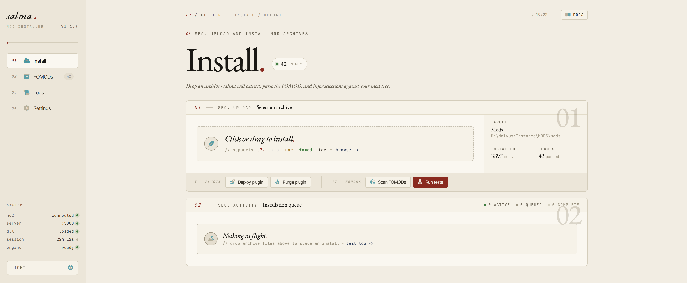
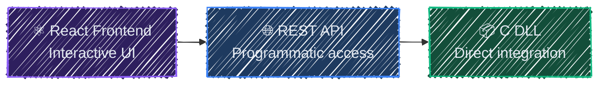
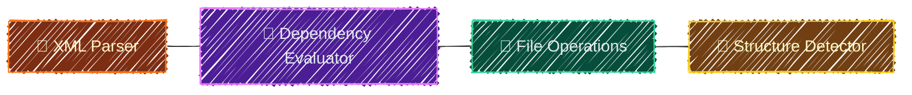
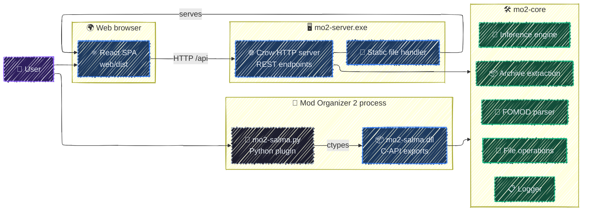

<div align="center">

# salma
**Wizardless FOMOD installer with automatic selection inference**

🎀 [Features](#features) | 💃 [Quick Start](#quick-start) | 📘 [Documentation](#documentation) | 🤝 [Contributing](./CONTRIBUTING.md)

![ReactJS](https://img.shields.io/badge/React-TSX-61DAFB.svg?style=flat&logo=data:image/svg+xml;base64,PHN2ZyB2aWV3Qm94PSIwIDAgMjQgMjQiIGZpbGw9Im5vbmUiIHhtbG5zPSJodHRwOi8vd3d3LnczLm9yZy8yMDAwL3N2ZyI+PGcgaWQ9IlNWR1JlcG9fYmdDYXJyaWVyIiBzdHJva2Utd2lkdGg9IjAiPjwvZz48ZyBpZD0iU1ZHUmVwb190cmFjZXJDYXJyaWVyIiBzdHJva2UtbGluZWNhcD0icm91bmQiIHN0cm9rZS1saW5lam9pbj0icm91bmQiPjwvZz48ZyBpZD0iU1ZHUmVwb19pY29uQ2FycmllciI+IDxwYXRoIGQ9Ik0xMi4wMDAyIDEyVjE0QzEzLjEwNDggMTQgMTQuMDAwMiAxMy4xMDQ1IDE0LjAwMDIgMTJIMTIuMDAwMlpNMTIuMDAwMiAxMkgxMC4wMDAyQzEwLjAwMDIgMTMuMTA0NSAxMC44OTU2IDE0IDEyLjAwMDIgMTRWMTJaTTEyLjAwMDIgMTJWOS45OTk5NUMxMC44OTU2IDkuOTk5OTUgMTAuMDAwMiAxMC44OTU0IDEwLjAwMDIgMTJIMTIuMDAwMlpNMTIuMDAwMiAxMkgxNC4wMDAyQzE0LjAwMDIgMTAuODk1NCAxMy4xMDQ4IDkuOTk5OTUgMTIuMDAwMiA5Ljk5OTk1VjEyWk0xMi4wMDAyIDEzSDEyLjAxMDJWMTFIMTIuMDAwMlYxM1pNMTQuODI4NiAxNC44Mjg0QzEyLjc1NzkgMTYuODk5MSAxMC41MzQ1IDE4LjM1NjYgOC42NDkwNyAxOS4wNjM2QzYuNjcwNzYgMTkuODA1NSA1LjQ1NzY0IDE5LjU5OTUgNC45MjkxMyAxOS4wNzFMMy41MTQ5MiAyMC40ODUyQzQuOTM5MDIgMjEuOTA5MyA3LjIzNDg4IDIxLjcyOTkgOS4zNTEzMiAyMC45MzYzQzExLjU2MDYgMjAuMTA3OCAxNC4wMTc4IDE4LjQ2NzcgMTYuMjQyOCAxNi4yNDI2TDE0LjgyODYgMTQuODI4NFpNNC45MjkxMyAxOS4wNzFDNC40MDA2MSAxOC41NDI1IDQuMTk0NjYgMTcuMzI5NCA0LjkzNjUzIDE1LjM1MTFDNS42NDM1OCAxMy40NjU2IDcuMTAxMDYgMTEuMjQyMiA5LjE3MTc3IDkuMTcxNTJMNy43NTc1NiA3Ljc1NzMxQzUuNTMyNSA5Ljk4MjM3IDMuODkyMzUgMTIuNDM5NSAzLjA2Mzg3IDE0LjY0ODhDMi4yNzAyIDE2Ljc2NTMgMi4wOTA4MSAxOS4wNjExIDMuNTE0OTIgMjAuNDg1Mkw0LjkyOTEzIDE5LjA3MVpNOS4xNzE3NyA5LjE3MTUyQzExLjI0MjUgNy4xMDA4MiAxMy40NjU4IDUuNjQzMzMgMTUuMzUxMyA0LjkzNjI4QzE3LjMyOTYgNC4xOTQ0MSAxOC41NDI3IDQuNDAwMzcgMTkuMDcxMyA0LjkyODg4TDIwLjQ4NTUgMy41MTQ2N0MxOS4wNjE0IDIuMDkwNTYgMTYuNzY1NSAyLjI2OTk2IDE0LjY0OTEgMy4wNjM2MkMxMi40Mzk4IDMuODkyMSA5Ljk4MjYyIDUuNTMyMjUgNy43NTc1NiA3Ljc1NzMxTDkuMTcxNzcgOS4xNzE1MlpNMTkuMDcxMyA0LjkyODg4QzE5LjU5OTggNS40NTc0IDE5LjgwNTcgNi42NzA1MSAxOS4wNjM5IDguNjQ4ODNDMTguMzU2OCAxMC41MzQzIDE2Ljg5OTMgMTIuNzU3NyAxNC44Mjg2IDE0LjgyODRMMTYuMjQyOCAxNi4yNDI2QzE4LjQ2NzkgMTQuMDE3NSAyMC4xMDggMTEuNTYwNCAyMC45MzY1IDkuMzUxMDhDMjEuNzMwMiA3LjIzNDY0IDIxLjkwOTYgNC45Mzg3OCAyMC40ODU1IDMuNTE0NjdMMTkuMDcxMyA0LjkyODg4Wk0xNC44Mjg2IDkuMTcxNTJDMTYuODk5MyAxMS4yNDIyIDE4LjM1NjggMTMuNDY1NiAxOS4wNjM5IDE1LjM1MTFDMTkuODA1NyAxNy4zMjk0IDE5LjU5OTggMTguNTQyNSAxOS4wNzEzIDE5LjA3MUwyMC40ODU1IDIwLjQ4NTJDMjEuOTA5NiAxOS4wNjExIDIxLjczMDIgMTYuNzY1MyAyMC45MzY1IDE0LjY0ODhDMjAuMTA4IDEyLjQzOTUgMTguNDY3OSA5Ljk4MjM3IDE2LjI0MjggNy43NTczMUwxNC44Mjg2IDkuMTcxNTJaTTE5LjA3MTMgMTkuMDcxQzE4LjU0MjcgMTkuNTk5NSAxNy4zMjk2IDE5LjgwNTUgMTUuMzUxMyAxOS4wNjM2QzEzLjQ2NTggMTguMzU2NiAxMS4yNDI1IDE2Ljg5OTEgOS4xNzE3NyAxNC44Mjg0TDcuNzU3NTYgMTYuMjQyNkM5Ljk4MjYyIDE4LjQ2NzcgMTIuNDM5OCAyMC4xMDc4IDE0LjY0OTEgMjAuOTM2M0MxNi43NjU1IDIxLjcyOTkgMTkuMDYxNCAyMS45MDkzIDIwLjQ4NTUgMjAuNDg1MkwxOS4wNzEzIDE5LjA3MVpNOS4xNzE3NyAxNC44Mjg0QzcuMTAxMDYgMTIuNzU3NyA1LjY0MzU4IDEwLjUzNDMgNC45MzY1MyA4LjY0ODgzQzQuMTk0NjYgNi42NzA1MSA0LjQwMDYxIDUuNDU3NCA0LjkyOTEzIDQuOTI4ODhMMy41MTQ5MSAzLjUxNDY3QzIuMDkwODEgNC45Mzg3OCAyLjI3MDIgNy4yMzQ2NCAzLjA2Mzg3IDkuMzUxMDhDMy44OTIzNSAxMS41NjA0IDUuNTMyNSAxNC4wMTc1IDcuNzU3NTYgMTYuMjQyNkw5LjE3MTc3IDE0LjgyODRaTTQuOTI5MTMgNC45Mjg4OEM1LjQ1NzY0IDQuNDAwMzcgNi42NzA3NiA0LjE5NDQxIDguNjQ5MDcgNC45MzYyOEMxMC41MzQ1IDUuNjQzMzMgMTIuNzU3OSA3LjEwMDgyIDE0LjgyODYgOS4xNzE1MkwxNi4yNDI4IDcuNzU3MzFDMTQuMDE3OCA1LjUzMjI1IDExLjU2MDYgMy44OTIxIDkuMzUxMzIgMy4wNjM2MkM3LjIzNDg4IDIuMjY5OTYgNC45MzkwMiAyLjA5MDU2IDMuNTE0OTEgMy41MTQ2N0w0LjkyOTEzIDQuOTI4ODhaIiBmaWxsPSIjZmZmZmZmIj48L3BhdGg+IDwvZz48L3N2Zz4=)
![Crow](https://img.shields.io/badge/Crow-HTTP-D97706.svg?style=flat&logo=data:image/svg+xml;base64,PHN2ZyBmaWxsPSIjZmZmZmZmIiB2aWV3Qm94PSIwIC02NCA2NDAgNjQwIiB4bWxucz0iaHR0cDovL3d3dy53My5vcmcvMjAwMC9zdmciPjxnIGlkPSJTVkdSZXBvX2JnQ2FycmllciIgc3Ryb2tlLXdpZHRoPSIwIj48L2c+PGcgaWQ9IlNWR1JlcG9fdHJhY2VyQ2FycmllciIgc3Ryb2tlLWxpbmVjYXA9InJvdW5kIiBzdHJva2UtbGluZWpvaW49InJvdW5kIj48L2c+PGcgaWQ9IlNWR1JlcG9faWNvbkNhcnJpZXIiPjxwYXRoIGQ9Ik01NDQgMzJoLTE2LjM2QzUxMy4wNCAxMi42OCA0OTAuMDkgMCA0NjQgMGMtNDQuMTggMC04MCAzNS44Mi04MCA4MHYyMC45OEwxMi4wOSAzOTMuNTdBMzAuMjE2IDMwLjIxNiAwIDAgMCAwIDQxNy43NGMwIDIyLjQ2IDIzLjY0IDM3LjA3IDQzLjczIDI3LjAzTDE2NS4yNyAzODRoOTYuNDlsNDQuNDEgMTIwLjFjMi4yNyA2LjIzIDkuMTUgOS40NCAxNS4zOCA3LjE3bDIyLjU1LTguMjFjNi4yMy0yLjI3IDkuNDQtOS4xNSA3LjE3LTE1LjM4TDMxMi45NCAzODRIMzUyYzEuOTEgMCAzLjc2LS4yMyA1LjY2LS4yOWw0NC41MSAxMjAuMzhjMi4yNyA2LjIzIDkuMTUgOS40NCAxNS4zOCA3LjE3bDIyLjU1LTguMjFjNi4yMy0yLjI3IDkuNDQtOS4xNSA3LjE3LTE1LjM4bC00MS4yNC0xMTEuNTNDNDg1Ljc0IDM1Mi44IDU0NCAyNzkuMjYgNTQ0IDE5MnYtODBsOTYtMTZjMC0zNS4zNS00Mi45OC02NC05Ni02NHptLTgwIDcyYy0xMy4yNSAwLTI0LTEwLjc1LTI0LTI0IDAtMTMuMjYgMTAuNzUtMjQgMjQtMjRzMjQgMTAuNzQgMjQgMjRjMCAxMy4yNS0xMC43NSAyNC0yNCAyNHoiPjwvcGF0aD48L2c+PC9zdmc+)
![Mo2](https://img.shields.io/badge/Mo2-Dll-64748B.svg?style=flat&logo=data:image/svg+xml;base64,PHN2ZyBmaWxsPSIjZmZmZmZmIiB2ZXJzaW9uPSIxLjEiIGlkPSJDYXBhXzEiIHhtbG5zPSJodHRwOi8vd3d3LnczLm9yZy8yMDAwL3N2ZyIgeG1sbnM6eGxpbms9Imh0dHA6Ly93d3cudzMub3JnLzE5OTkveGxpbmsiIHZpZXdCb3g9Ii0xMjIuNCAtMTIyLjQgODU2LjgwIDg1Ni44MCIgeG1sOnNwYWNlPSJwcmVzZXJ2ZSI+PGcgaWQ9IlNWR1JlcG9fYmdDYXJyaWVyIiBzdHJva2Utd2lkdGg9IjAiPjwvZz48ZyBpZD0iU1ZHUmVwb190cmFjZXJDYXJyaWVyIiBzdHJva2UtbGluZWNhcD0icm91bmQiIHN0cm9rZS1saW5lam9pbj0icm91bmQiPjwvZz48ZyBpZD0iU1ZHUmVwb19pY29uQ2FycmllciI+IDxnPiA8cGF0aCBkPSJNNDgyLjE4OCw4My4zMzNMMTg0LjYyMiwyMjMuMjI1djg5LjgzMmwtNTEuOTEtMjMuMDgydi04OS44MzJMNDMwLjI3OCw2MC4yNTJsLTk5Ljk0Ni00NC40MzkgYy0xMy4zODMtNS45NS0zNS4yODEtNS45NS00OC42NjQsMEwzNS41NTcsMTI1LjI0M0MxNS45NSwxMzMuOTYxLTAuMDUsMTU4LjY0OSwwLDE4MC4xMDdsMC42MDYsMjU2LjUzNCBjMC4wNTEsMjEuNjg2LDE2LjQwOCw0Ni40MDEsMzYuMzQ4LDU0LjkyNkwyODIuNDIsNTk2LjQ5OWMxMi45NDUsNS41MzQsMzQuMTI5LDUuNTM0LDQ3LjA3NSwwLjAwM2wyNDUuNTUtMTA0LjkzNiBjMTkuOTM5LTguNTIxLDM2LjI5Ny0zMy4yMzQsMzYuMzQ4LTU0LjkxOUw2MTIsMTgwLjEwN2MwLjA1MS0yMS40NTgtMTUuOTQ5LTQ2LjE0Ni0zNS41NTctNTQuODY0TDQ4Mi4xODgsODMuMzMzeiBNNTU2LjM5OCwyODguNjc1bC0xNC40MDMsNi42ODNsLTAuMjkyLDEwMS4zNTNjLTAuMDEzLDQuNDI5LTMuOTI1LDkuNzAxLTguNzI3LDExLjc3M2wtMjEuNTYzLDkuMzA5IGMtNC43MjcsMi4wNDEtOC41NTEsMC4xNDktOC41NTQtNC4yMjNsLTAuMDczLTEwMC4wMjFsLTEzLjk1MSw2LjQ3MmMtNi41NjIsMy4wNDQtMTAuNjY5LTEuNzI5LTcuNDExLTguNjAxbDMzLjM0OC03MC4zNTYgYzMuMzY2LTcuMTAyLDExLjgwNi0xMS4xOTksMTUuMTg0LTcuMzQ3bDM0LjIyMSwzOS4wMTJDNTY3LjU5MywyNzYuNjIzLDU2My4yNTcsMjg1LjQ5NCw1NTYuMzk4LDI4OC42NzV6IE00MTUuNTk2LDQ1MS40NDMgYzAuMDM3LDQuMjQzLTMuNTUsOS4yNC04LjAwMSwxMS4xNjJsLTE5Ljk5Niw4LjYzMmMtNC4zODUsMS44OTMtNy45NzIsMC4wMjktOC4wMjItNC4xNmwtMS4xNzEtOTUuODI2bC0xMi45MzgsNi4wMDIgYy02LjA4NSwyLjgyMy05Ljk2OC0xLjgwOC03LjAwNi04LjM0NGwzMC4zMS02Ni44ODFjMy4wNTctNi43NDcsMTAuODczLTEwLjU0MSwxNC4wNjItNi44MDVsMzIuMzAxLDM3LjgzNiBjMy4yMjYsMy43NzctMC43MTIsMTIuMjAyLTcuMDYyLDE1LjE0N2wtMTMuMzM4LDYuMTg4TDQxNS41OTYsNDUxLjQ0M3ogTTU4MC4yMDEsNDIzLjYxOWMtMC4wMTUsMi4yMjYtMi4wMTYsNC44NjUtNC40NjgsNS44OTYgbC0yMjguMzk1LDk1Ljk1Yy0yLjEzMSwwLjg5Ni0zLjg4NC0wLjA0My0zLjkxNS0yLjA5NmwtMC4xNzUtMTEuMTYyYy0wLjAzMi0yLjA1OCwxLjY3LTQuNDYzLDMuODA1LTUuMzcybDIyOC44MDItOTcuNDY3IGMyLjQ1NS0xLjA0Niw0LjQzOC0wLjA4Niw0LjQyMywyLjE0Nkw1ODAuMjAxLDQyMy42MTl6Ij48L3BhdGg+IDwvZz4gPC9nPjwvc3ZnPg==)
![Tailwind](https://img.shields.io/badge/Tailwind-CSS-2DD4BF.svg?style=flat&logo=data:image/svg+xml;base64,PHN2ZyB2aWV3Qm94PSItMS41IC0xLjUgMTguMDAgMTguMDAiIGZpbGw9Im5vbmUiIHhtbG5zPSJodHRwOi8vd3d3LnczLm9yZy8yMDAwL3N2ZyI+PGcgaWQ9IlNWR1JlcG9fYmdDYXJyaWVyIiBzdHJva2Utd2lkdGg9IjAiPjwvZz48ZyBpZD0iU1ZHUmVwb190cmFjZXJDYXJyaWVyIiBzdHJva2UtbGluZWNhcD0icm91bmQiIHN0cm9rZS1saW5lam9pbj0icm91bmQiPjwvZz48ZyBpZD0iU1ZHUmVwb19pY29uQ2FycmllciI+IDxwYXRoIGQ9Ik03LjUwMDA2IDIuNUM2LjQ3NDA5IDIuNSA1LjU5MjAzIDIuNzc2OTEgNC44OTk2NiAzLjM3MDM3QzQuMjEyMjcgMy45NTk1NiAzLjc2MjU5IDQuODE3MjkgMy41MTMxNCA1Ljg4NjM4QzMuNDU4NjkgNi4xMTk3IDMuNTc3NDIgNi4zNTg4NSAzLjc5NjE5IDYuNDU2NTRDNC4wMTQ5NiA2LjU1NDIzIDQuMjcyMjggNi40ODMgNC40MDk2NyA2LjI4NjcyQzQuNzI2MyA1LjgzNDQgNS4wNDI0NCA1LjU2MjYxIDUuMzQ2MiA1LjQyMzEzQzUuNjQwMzggNS4yODgwNSA1Ljk1NzQ4IDUuMjYwNjggNi4zMjA2OSA1LjM1Nzk3QzYuNjg3MjMgNS40NTYxNSA2Ljk3MDk3IDUuNzQzNjkgNy40MTY0MyA2LjIyODE2TDcuNDMwODIgNi4yNDM4MkM3Ljc2NjYxIDYuNjA5MDUgOC4xNzYyMyA3LjA1NDYgOC43MzY0OSA3LjQwMDI4QzkuMzE3ODUgNy43NTg5OCAxMC4wNDEzIDcuOTk5OTkgMTEuMDAwMSA3Ljk5OTk5QzEyLjAyNiA3Ljk5OTk5IDEyLjkwODEgNy43MjMwNyAxMy42MDA1IDcuMTI5NjJDMTQuMjg3OCA2LjU0MDQzIDE0LjczNzUgNS42ODI3IDE0Ljk4NyA0LjYxMzYxQzE1LjA0MTQgNC4zODAyOSAxNC45MjI3IDQuMTQxMTQgMTQuNzAzOSA0LjA0MzQ1QzE0LjQ4NTIgMy45NDU3NiAxNC4yMjc4IDQuMDE2OTggMTQuMDkwNCA0LjIxMzI2QzEzLjc3MzggNC42NjU1OSAxMy40NTc3IDQuOTM3MzcgMTMuMTUzOSA1LjA3Njg2QzEyLjg1OTcgNS4yMTE5NCAxMi41NDI2IDUuMjM5MzEgMTIuMTc5NCA1LjE0MjAyQzExLjgxMjkgNS4wNDM4NCAxMS41MjkxIDQuNzU2MyAxMS4wODM3IDQuMjcxODJMMTEuMDY5MyA0LjI1NjE2QzEwLjczMzUgMy44OTA5MyAxMC4zMjM5IDMuNDQ1MzggOS43NjM2MiAzLjA5OTcxQzkuMTgyMjcgMi43NDEwMSA4LjQ1ODgzIDIuNSA3LjUwMDA2IDIuNVoiIGZpbGw9IiNmZmZmZmYiPjwvcGF0aD4gPHBhdGggZD0iTTQuMDAwMDYgNi45OTk5OUMyLjk3NDA5IDYuOTk5OTkgMi4wOTIwMyA3LjI3NjkgMS4zOTk2NiA3Ljg3MDM2QzAuNzEyMjcxIDguNDU5NTUgMC4yNjI1OTIgOS4zMTcyNyAwLjAxMzEzNjUgMTAuMzg2NEMtMC4wNDEzMDU3IDEwLjYxOTcgMC4wNzc0MTYyIDEwLjg1ODggMC4yOTYxODYgMTAuOTU2NUMwLjUxNDk1NiAxMS4wNTQyIDAuNzcyMjc2IDEwLjk4MyAwLjkwOTY3MyAxMC43ODY3QzEuMjI2MyAxMC4zMzQ0IDEuNTQyNDQgMTAuMDYyNiAxLjg0NjIgOS45MjMxMkMyLjE0MDM4IDkuNzg4MDQgMi40NTc0NyA5Ljc2MDY3IDIuODIwNjkgOS44NTc5NkMzLjE4NzIzIDkuOTU2MTQgMy40NzA5NyAxMC4yNDM3IDMuOTE2NDMgMTAuNzI4MkwzLjkzMDgyIDEwLjc0MzhDNC4yNjY2IDExLjEwOSA0LjY3NjI0IDExLjU1NDYgNS4yMzY0OSAxMS45MDAzQzUuODE3ODUgMTIuMjU5IDYuNTQxMjggMTIuNSA3LjUwMDA2IDEyLjVDOC41MjYwMiAxMi41IDkuNDA4MDggMTIuMjIzMSAxMC4xMDA1IDExLjYyOTZDMTAuNzg3OCAxMS4wNDA0IDExLjIzNzUgMTAuMTgyNyAxMS40ODcgOS4xMTM2QzExLjU0MTQgOC44ODAyNyAxMS40MjI3IDguNjQxMTMgMTEuMjAzOSA4LjU0MzQzQzEwLjk4NTIgOC40NDU3NCAxMC43Mjc4IDguNTE2OTcgMTAuNTkwNCA4LjcxMzI1QzEwLjI3MzggOS4xNjU1OCA5Ljk1NzY4IDkuNDM3MzYgOS42NTM5MSA5LjU3Njg0QzkuMzU5NzQgOS43MTE5MiA5LjA0MjY0IDkuNzM5MyA4LjY3OTQyIDkuNjQyMDFDOC4zMTI4OSA5LjU0MzgzIDguMDI5MTUgOS4yNTYyOCA3LjU4MzY5IDguNzcxODFMNy41NjkyOSA4Ljc1NjE1QzcuMjMzNTEgOC4zOTA5MiA2LjgyMzg4IDcuOTQ1MzcgNi4yNjM2MiA3LjU5OTY5QzUuNjgyMjcgNy4yNDEgNC45NTg4MyA2Ljk5OTk5IDQuMDAwMDYgNi45OTk5OVoiIGZpbGw9IiNmZmZmZmYiPjwvcGF0aD4gPC9nPjwvc3ZnPg==)


![License](https://img.shields.io/badge/License-MIT-475569.svg?logo=data:image/svg+xml;base64,PHN2ZyBmaWxsPSIjZmZmZmZmIiB3aWR0aD0iMTY0cHgiIGhlaWdodD0iMTY0cHgiIHZpZXdCb3g9IjAgMCA1MTIuMDAgNTEyLjAwIiB4bWxucz0iaHR0cDovL3d3dy53My5vcmcvMjAwMC9zdmciIHN0cm9rZT0iI2ZmZmZmZiIgc3Ryb2tlLXdpZHRoPSIwLjAwNTEyIj48ZyBpZD0iU1ZHUmVwb19iZ0NhcnJpZXIiIHN0cm9rZS13aWR0aD0iMCI+PC9nPjxnIGlkPSJTVkdSZXBvX3RyYWNlckNhcnJpZXIiIHN0cm9rZS1saW5lY2FwPSJyb3VuZCIgc3Ryb2tlLWxpbmVqb2luPSJyb3VuZCIgc3Ryb2tlPSIjQ0NDQ0NDIiBzdHJva2Utd2lkdGg9IjMuMDcyIj48L2c+PGcgaWQ9IlNWR1JlcG9faWNvbkNhcnJpZXIiPjxwYXRoIGQ9Ik0yNTYgOEMxMTkuMDMzIDggOCAxMTkuMDMzIDggMjU2czExMS4wMzMgMjQ4IDI0OCAyNDggMjQ4LTExMS4wMzMgMjQ4LTI0OFMzOTIuOTY3IDggMjU2IDh6bTExNy4xMzQgMzQ2Ljc1M2MtMS41OTIgMS44NjctMzkuNzc2IDQ1LjczMS0xMDkuODUxIDQ1LjczMS04NC42OTIgMC0xNDQuNDg0LTYzLjI2LTE0NC40ODQtMTQ1LjU2NyAwLTgxLjMwMyA2Mi4wMDQtMTQzLjQwMSAxNDMuNzYyLTE0My40MDEgNjYuOTU3IDAgMTAxLjk2NSAzNy4zMTUgMTAzLjQyMiAzOC45MDRhMTIgMTIgMCAwIDEgMS4yMzggMTQuNjIzbC0yMi4zOCAzNC42NTVjLTQuMDQ5IDYuMjY3LTEyLjc3NCA3LjM1MS0xOC4yMzQgMi4yOTUtLjIzMy0uMjE0LTI2LjUyOS0yMy44OC02MS44OC0yMy44OC00Ni4xMTYgMC03My45MTYgMzMuNTc1LTczLjkxNiA3Ni4wODIgMCAzOS42MDIgMjUuNTE0IDc5LjY5MiA3NC4yNzcgNzkuNjkyIDM4LjY5NyAwIDY1LjI4LTI4LjMzOCA2NS41NDQtMjguNjI1IDUuMTMyLTUuNTY1IDE0LjA1OS01LjAzMyAxOC41MDggMS4wNTNsMjQuNTQ3IDMzLjU3MmExMi4wMDEgMTIuMDAxIDAgMCAxLS41NTMgMTQuODY2eiI+PC9wYXRoPjwvZz48L3N2Zz4=)
<br/>
[](https://sonarcloud.io/summary/new_code?id=lextpf_salma)
[](https://sonarcloud.io/summary/new_code?id=lextpf_salma)
[](https://sonarcloud.io/summary/new_code?id=lextpf_salma)
<br/>
[](https://github.com/lextpf/salma/actions/workflows/build.yml)
[](https://github.com/lextpf/salma/actions/workflows/test.yml)
<br/>
![Sponsor](https://img.shields.io/static/v1?label=sponsor&message=%E2%9D%A4&color=ff69b4&logo=data:image/svg+xml;base64,PHN2ZyB4bWxucz0iaHR0cDovL3d3dy53My5vcmcvMjAwMC9zdmciIHZpZXdCb3g9IjAgMCA2NDAgNjQwIj48IS0tIUZvbnQgQXdlc29tZSBQcm8gdjcuMi4wIGJ5IEBmb250YXdlc29tZSAtIGh0dHBzOi8vZm9udGF3ZXNvbWUuY29tIExpY2Vuc2UgLSBodHRwczovL2ZvbnRhd2Vzb21lLmNvbS9saWNlbnNlIChDb21tZXJjaWFsIExpY2Vuc2UpIENvcHlyaWdodCAyMDI2IEZvbnRpY29ucywgSW5jLi0tPjxwYXRoIG9wYWNpdHk9IjEiIGZpbGw9IiNmZjY5YjRmZiIgZD0iTTMyIDQ4MEwzMiA1NDRDMzIgNTYxLjcgNDYuMyA1NzYgNjQgNTc2TDM4NC41IDU3NkM0MTMuNSA1NzYgNDQxLjggNTY2LjcgNDY1LjIgNTQ5LjVMNTkxLjggNDU2LjJDNjA5LjYgNDQzLjEgNjEzLjQgNDE4LjEgNjAwLjMgNDAwLjNDNTg3LjIgMzgyLjUgNTYyLjIgMzc4LjcgNTQ0LjQgMzkxLjhMNDI0LjYgNDgwTDMxMiA0ODBDMjk4LjcgNDgwIDI4OCA0NjkuMyAyODggNDU2QzI4OCA0NDIuNyAyOTguNyA0MzIgMzEyIDQzMkwzODQgNDMyQzQwMS43IDQzMiA0MTYgNDE3LjcgNDE2IDQwMEM0MTYgMzgyLjMgNDAxLjcgMzY4IDM4NCAzNjhMMjMxLjggMzY4QzE5Ny45IDM2OCAxNjUuMyAzODEuNSAxNDEuMyA0MDUuNUw5OC43IDQ0OEw2NCA0NDhDNDYuMyA0NDggMzIgNDYyLjMgMzIgNDgweiIvPjxwYXRoIGZpbGw9InJnYmEoMjU1LCAyNTUsIDI1NSwgMS4wMCkiIGQ9Ik0yNTAuOSA2NEMyNzQuOSA2NCAyOTcuNSA3NS41IDMxMS42IDk1TDMyMCAxMDYuN0wzMjguNCA5NUMzNDIuNSA3NS41IDM2NS4xIDY0IDM4OS4xIDY0QzQzMC41IDY0IDQ2NCA5Ny41IDQ2NCAxMzguOUw0NjQgMTQxLjNDNDY0IDIwNS43IDM4MiAyNzQuNyAzNDEuOCAzMDQuNkMzMjguOCAzMTQuMyAzMTEuMyAzMTQuMyAyOTguMyAzMDQuNkMyNTguMSAyNzQuNiAxNzYgMjA1LjcgMTc2LjEgMTQxLjNMMTc2LjEgMTM4LjlDMTc2IDk3LjUgMjA5LjUgNjQgMjUwLjkgNjR6Ii8+PC9zdmc+)
</div>

**A mod installer** built with **C++23** and powered by *Crow* and *React*. It pairs a **C DLL** that handles archive extraction and FOMOD processing with a **Crow HTTP server** and **React web interface** for interactive installations. salma integrates with **Mod Organizer 2** via a Python plugin, automatically **inferring FOMOD selections** by comparing archives against installed files - no wizard clicks required.

<div align="center">
<br>



</div>

> [!IMPORTANT]
> **Early release** - salma is under active development and has been tested against:
> - **Nolvus Ascension 6.0.20** with **350 FOMODs**.
> - Other mods should work without issues - if you run into a problem, please report it.

```
/* ============================================================================================== *
 *
 *       ::::::::      :::     :::        ::::    ::::      :::         ⢠⣤⣤⣀ ⠀⠀⠀⠀⠀⠀ ⣀⣤⣤⡄
 *      :+:    :+:   :+: :+:   :+:        +:+:+: :+:+:+   :+: :+:      ⢸⣿⣿⣿⣿⣦⣄⣀⣠⣴⣿⣿⣿⣿⡇⠀⊹
 *      +:+         +:+   +:+  +:+        +:+ +:+:+ +:+  +:+   +:+     ⣸⣿⣿⣿⣿⣿⡽⣿⣯⣿⣿⣿⣿⣿⣇
 *      +#++:++#++ +#++:++#++: +#+        +#+  +:+  +#+ +#++:++#++:    ⢻⣿⣿⣿⠿⣻⣵⡟⣮⣟⠿⣿⣿⣿⡟
 *             +#+ +#+     +#+ +#+        +#+       +#+ +#+     +#+    ⠀⠀⠀⠀⣼⣿⡿ ⠀⢿⣿⣷⡀
 *      #+#    #+# #+#     #+# #+#        #+#       #+# #+#     #+#    ⊹⠀⣠⣾⣿⣿⠃ ⠀⠈⢿⣿⣿⣦⡀
 *       ########  ###     ### ########## ###       ### ###     ###    ⠀⠈⠉⠹⡿⠁⠀⠀⠀⠀⠈⢻⡇⠉⠉
 *
 *                                 << M O D   I N S T A L L E R >>
 *
 * ============================================================================================== */
```

## Features

### Interface

salma ships with a **C DLL** for direct integration, a **REST API** for programmatic access, and a **React web UI** for interactive installations.



### FOMOD Processing



- 📄 **XML Parser** - Parses `fomod/ModuleConfig.xml` for installation steps and options
- 🧩 **Dependency Evaluator** - Resolves flag-based and file-based FOMOD dependencies
- 📂 **File Operations** - Priority-sorted file copy, folder creation, and patching
- 🔎 **Structure Detector** - Identifies mod folder layout (meshes/, textures/, SKSE/, etc.)

### Inference Engine

salma's inference service compares an archive's FOMOD options against an already-installed mod to determine which selections were originally chosen. Naively walking every permutation of steps, groups, and flags is intractable on large installers, so the pipeline is a layered solver:

- ⚡ **Tier-1 shortcut** - reads cached fomod-plus JSON directly from `meta.ini` when present and skips the rest of the pipeline. Hits on a large fraction of mods produced by an MO2 user who already ran the wizard once.
- 🧮 **Constraint propagator** - a deterministic pre-pass that narrows each group's plugin domain using plugin-type rules (`Required` / `NotUsable` / `SelectAll`), file-evidence elimination, and cardinality. Groups that resolve to a single combination skip the solver entirely.
- 🧠 **5-phase CSP solver** - greedy -> iterative local search -> independent-component decomposition -> residual repair (m=0, e=0) -> mismatch-focused search -> global fallback with widening `SelectAny` caps (narrow -> medium -> full). Each phase short-circuits on an exact reproduction.
- 🪞 **Forward simulator** - executes a candidate selection against the IR (without writing to disk) and scores the simulated file tree against the target with a five-key lex order: `(missing, extra, size_mismatch, hash_mismatch, -reproduced)`.
- 📋 Returns a JSON configuration that reproduces the original install
- 🧪 Powers the round-trip test suite for validation

### MO2 Integration

- 🐍 **Python Plugin** - `mo2-salma.py` loads the DLL via ctypes and exposes tools inside MO2
- 🔬 **Scan FOMOD Choices** - Batch-scans all installed mods for FOMOD selections
- 📁 **Centralized Output** - Reinstalled mods go to a dedicated "Salma FOMODs Output" folder
- ⚡ **Deploy & Purge** - `deploy.bat` and `purge.bat` scripts for plugin lifecycle management

### Archive Support

|  Format | Backend                                             |
|---------|-----------------------------------------------------|
| 7z      | bit7z (native 7-Zip SDK wrapper)                    |
| ZIP     | libarchive                                          |
| RAR     | libarchive                                          |
| TAR.*   | libarchive (bzip2, lz4, lzma, zstd)                 |

### Additional Capabilities

- 🌐 **REST API** - Full programmatic access for custom installers and automation
- 🎨 **Web UI** - React SPA with dark/light theme, served directly by the Crow backend
- 📝 **Logging** - Unified thread-safe logger with subsystem tags; 10 MiB rotation, up to 3 archived files
- 🧪 **Round-Trip Testing** - Infer selections, reinstall, and diff against the original mod

### Limits

The deliberate guardrails are:

- 📦 **256 MiB per-archive-entry cap** (`kMaxEntrySize` in `ArchiveService.cpp`) - guards against zip / 7z decompression bombs during in-memory reads.
- 📤 **512 MiB upload cap** (`kMaxUploadBytes` in `InstallationController::handle_upload`) - oversized multipart uploads return HTTP 413 before any temp-file write.
- 🛡️ **Path-traversal rejection** in `ArchiveService::extract_with_libarchive` and `extract_filtered` - any entry whose canonical destination falls outside the extraction root is dropped before write.
- 🚫 **Shell-metachar sanitization** in `Mo2Controller::deploy_plugin` / `purge_plugin` - blocks `& | > < ^ % ! ( ) " ; ' \`` in paths before they flow into a `cmd.exe` child process.
- ✅ **Whitelist regex on `run_tests` args** - `^[a-zA-Z0-9 _\-\.]*$`; quotes and path separators are excluded, and the literal `..` substring is rejected even within the whitelist.

## Technology Stack

| Component       | Technology                     |
|-----------------|--------------------------------|
| Language        | C++23                          |
| HTTP Framework  | Crow (with CORS handler)       |
| Frontend        | React 18 + TypeScript + Vite   |
| Styling         | Tailwind CSS 4                 |
| XML Parsing     | pugixml                        |
| JSON            | nlohmann-json                  |
| Archive         | libarchive + bit7z             |
| Formatting      | clang-format (Google-based)    |
| Build System    | CMake 3.20+                    |
| Package Manager | vcpkg                          |
| Documentation   | Doxide + MkDocs                |
| Plugin          | Python 3 (MO2 ctypes bridge)   |
| CI/CD           | GitHub Actions                 |
| Platform        | Windows 10/11 (64-bit)         |

## Quick Start

### Prerequisites

- **Windows 10/11** (64-bit)
- **Visual Studio 2022** (MSVC v143, C++23)
- **CMake 3.20+**
- **vcpkg** - set `VCPKG_ROOT`; the default CMake preset reads it directly. The build uses the **`x64-windows-static-md`** triplet;
the manifest in `vcpkg.json` pins versions, so the first configure may take several minutes while vcpkg builds the cache.
- **Node.js** (for building the React frontend)
- **Python 3** (for MO2 plugin and documentation post-processing)
- **clang-format** (optional, for code formatting - CI enforces it)
- **doxide** + **mkdocs** (optional, for API docs generation)

### Building

```powershell
# 1. Clone the repository
git clone https://github.com/lextpf/salma.git
cd salma

# 2. Build (format + configure + compile + docs)
.\build.bat

# 3. Run the server
.\build\bin\Release\mo2-server.exe
```

Output:
- DLL: `build/bin/Release/mo2-salma.dll`
- Server: `build/bin/Release/mo2-server.exe`
- Tests: `build/bin/Release/salma_tests.exe`

For a faster iteration loop, configure once and then scope the build to a single target:

```powershell
cmake --preset default                                     # configure (reads VCPKG_ROOT)
cmake --build build --config Release --target mo2-core     # DLL only
cmake --build build --config Release --target mo2-server   # EXE only
cmake --build build --config Release --target salma_tests  # unit-test binary only
```

`build.bat` runs `clang-format`, then configure, then a full Release build, and finally the optional doc pipeline (skipped silently if `doxide` and `mkdocs` are missing).

### Frontend development

The React SPA in `web/` builds into `web/dist/` and is served by `mo2-server.exe`. For interactive development use Vite's dev server, which proxies `/api/*` requests through to the C++ backend:

```powershell
cd web
npm install    # one-time
npm run dev    # Vite dev server on :3000, proxies /api -> :5000
npm run build  # outputs to web/dist/, served by Crow at :5000
npm run lint   # eslint, max-warnings=0
```

> [!IMPORTANT]
> Start `mo2-server.exe` on `:5000` **before** `npm run dev`. Vite's proxy assumes the backend is already up; if it isn't, every `/api/*` request the SPA makes will fail with a proxy error and the UI will look broken.

### Deploying to MO2

```powershell
# Copy DLL + Python plugin to your MO2 instance
.\deploy.bat
```

`deploy.bat` resolves the target as `<mods_path>/../../MO2/plugins/`, with `SALMA_DEPLOY_PATH` overriding the computed location. `purge.bat` removes them again.

## Configuration & Environment

salma reads a small set of environment variables at runtime. None are required for a default Quick Start build, but they unlock specific deployment / dev workflows.

| Variable               | Purpose                                                                         | Read by                              |
|------------------------|---------------------------------------------------------------------------------|--------------------------------------|
| `VCPKG_ROOT`           | vcpkg toolchain path used by the default CMake preset.                          | `CMakePresets.json`                  |
| `SALMA_BIND_ADDR`      | Override the default loopback bind. Non-loopback values log a security warning. | `main.cpp`                           |
| `SALMA_MODS_PATH`      | MO2 mods directory. Used by the deploy fallback chain and the round-trip tests. | `Mo2Helpers.cpp`, `test_all.py`          |
| `SALMA_DEPLOY_PATH`    | Override the `<MO2 instance>/MO2/plugins` deploy target used by `deploy.bat`.   | `Mo2Helpers.cpp`, `deploy.bat`       |
| `SALMA_DOWNLOADS_PATH` | Lookup root for `resolve_mod_archive` when `installationFile` is relative.      | `FomodArchiveResolver.cpp`           |

The mods/deploy/downloads trio above is **required** for the round-trip integration tests; see [Testing](#testing). A persistent setup helper exists for them:

```powershell
.\scripts\setup-env.bat   # sets the three SALMA_* vars via setx (persists across shells)
```

The runtime-configurable settings (currently just the MO2 mods directory) are persisted to `salma.json` next to `mo2-server.exe` by `ConfigService`. The dashboard's `PUT /api/config` endpoint writes it via a write-then-rename so a partial write cannot corrupt the file. The FOMOD output directory is **derived** from the mods path as `<mo2ModsPath>/Salma FOMODs Output/fomods/` and is not separately configurable.

## Testing

There are two test layers; treat them as separate workflows.

### C++ unit tests

```powershell
.\test.bat
```

Builds the `salma_tests` target and runs `salma_tests.exe`. Sources live under `tests/`. The build is the standard CMake target, so `cmake --build build --config Release --target salma_tests` and running the binary directly work too.

### Round-trip integration tests (Python)

```powershell
python test_all.py                       # walks every mod under SALMA_MODS_PATH
python test_one.py <archive> <mod>   # single-mod variant for debugging
```

`test_all.py` enumerates every mod folder under `SALMA_MODS_PATH`, infers FOMOD selections through the DLL, reinstalls the result into a temporary directory, and diffs the produced file tree against the original install. Output goes to `test.log` and `logs/salma.log`.

Round-trip tests require the **three `SALMA_*` env vars** listed in [Configuration & Environment](#configuration--environment). Run `scripts\setup-env.bat` once to set them via `setx` (persists across shells); the test scripts no longer fall back to a hardcoded path and exit with a setup hint if any required variable is unset.

## Architecture

salma ships **three deployment artifacts** that share **one core library**. The library (`mo2-core`) holds all the actual installation, FOMOD parsing, and inference logic. The artifacts are different *shells* around that library - one for MO2 (a DLL), one for HTTP (an EXE), and one for the browser (a React SPA served by the EXE). You can use any subset depending on how you want to drive salma.



### The three artifacts

- **📦 `mo2-salma.dll` - the headless library.** Built from the `mo2-core` CMake target. Has no HTTP, no UI, no Crow dependency. Mod Organizer 2 loads it through `mo2-salma.py` (a Python plugin) using `ctypes` and calls C-linkage exports like `install()`, `inferFomodSelections()`, and `installWithConfig()`. **Use this when** you want MO2 to install FOMOD-aware mods without the wizard.

- **🌐 `mo2-server.exe` - the HTTP shell.** Built from the `mo2-server` CMake target. Links the same `mo2-core` library that the DLL exports, **plus** the Crow HTTP framework on top. Exposes the install / infer / scan / status / log endpoints under `/api/*` and serves the React SPA from `web/dist/` at `/`. Listens on `:5000`. **Use this when** you want a graphical interface or programmatic REST access.

- **⚛️ `web/dist/` - the browser front-end.** Built with Vite from `web/src/`. Pure HTML/CSS/JS - knows nothing about C++. Talks to `mo2-server.exe` over `fetch('/api/...')`. **Use this when** you want to drive an installation interactively, browse FOMOD JSON files, or watch logs in real time.

> [!NOTE]
> The DLL and the EXE are different binaries built from the same source tree. They share `mo2-core` so that improving FOMOD inference once benefits both the MO2 plugin and the web UI - there is no duplicated logic to keep in sync.

### Two ways salma is used

**Path A - inside Mod Organizer 2 (no server, no browser).**

1. `deploy.bat` copies `mo2-salma.dll` and `mo2-salma.py` into `<MO2 instance>/plugins/`.
2. MO2 starts and Python loads `mo2-salma.py`.
3. The plugin loads the DLL via `ctypes.CDLL("mo2-salma.dll")`.
4. When the user installs a mod, the plugin calls `install()` (or `inferFomodSelections()` for batch scans) directly into `mo2-core`.
5. Results return as JSON or path strings; the plugin renders them in MO2's tools menu.

**Path B - the standalone server with the web UI.**

1. The user runs `mo2-server.exe` (port 5000).
2. The browser opens `http://localhost:5000` and the server's static handler returns `web/dist/index.html`.
3. The React SPA loads, then calls endpoints like `POST /api/installation/upload` for file uploads or `GET /api/mo2/fomods/scan/status` for background-job progress.
4. The Crow controllers in `mo2-server` translate those requests into calls into `mo2-core` (the same calls the DLL exports).
5. Results come back as JSON; the SPA renders progress, logs, and FOMOD trees.

Both paths converge in `mo2-core`. The DLL exposes it as a flat C ABI; the server exposes it as REST endpoints.

### File-to-purpose drill-down

|                       File | Purpose                                          |
|----------------------------|--------------------------------------------------|
|                 `main.cpp` | Crow HTTP server entry point                     |
|     `InstallationService`  | Main orchestrator for mod installation           |
|         `ArchiveService`   | Archive extraction (libarchive + bit7z)          |
|           `FomodService`   | FOMOD XML parsing and installation logic         |
|   `FomodInferenceService`  | Infers FOMOD selections from installed files     |
| `FomodDependencyEvaluator` | Evaluates FOMOD flag and file dependencies       |
|        `FileOperations`    | Priority-sorted file copy and patching           |
|     `ModStructureDetector` | Detects mod folder layout                        |
|                  `CApi`    | C-linkage DLL exports for ctypes                 |
|                `Logger`    | Thread-safe logging with callback support        |
|         `ConfigService`    | Configuration management                         |

## Project Structure

```
salma/
|-- .github/                            # CI workflows
|   +-- workflows/                      # build.yml, sonar.yml, test.yml
|-- src/                                # C++ source code
|   |-- main.cpp                        # Crow HTTP server entry point
|   |-- CApi.h/cpp                      # C-linkage DLL API (ctypes)
|   |-- Export.h                        # MO2_API export macro
|   |-- Types.h                         # Shared type definitions
|   |-- Utils.h/cpp                     # Shared string/path helpers
|   |-- BackgroundJob.h                 # Async job runner
|   |-- Logger.h/cpp                    # Thread-safe logging
|   |-- ArchiveService.h/cpp            # Archive extraction
|   |-- FileOperations.h/cpp            # Queued file operations
|   |-- ModStructureDetector.h/cpp      # Mod folder structure detection
|   |-- FomodArchiveResolver.h/cpp      # Resolves mod source archive paths
|   |-- FomodService.h/cpp              # FOMOD installation logic
|   |-- FomodDependencyEvaluator.h/cpp  # FOMOD dependency evaluation
|   |-- FomodInferenceService.h/cpp     # Selection inference engine (orchestrator)
|   |-- FomodIR.h                       # FOMOD IR types (header-only)
|   |-- FomodIRParser.h/cpp             # XML to IR parser
|   |-- FomodCSP*.h/cpp                 # CSP solver, options, precompute, types
|   |-- FomodPropagator.h/cpp           # Constraint propagator
|   |-- FomodForwardSimulator.h/cpp     # Forward-simulates installs against the IR
|   |-- FomodInferenceAtoms.h/cpp       # Atom-level inference helpers
|   |-- FomodAtom.h                     # Atom type definitions
|   |-- InstallationService.h/cpp       # Main orchestrator
|   |-- InstallationController.h/cpp    # REST endpoint handlers
|   |-- Mo2Controller.h/cpp             # MO2 dashboard controller (shared state)
|   |-- Mo2...Controller.cpp            # Per-subsystem endpoints
|   |-- Mo2Helpers.h/cpp                # Shared helpers for MO2 controllers
|   |-- ConfigService.h/cpp             # Configuration management
|   |-- MultipartHandler.h/cpp          # Form data parsing
|   +-- StaticFileHandler.h/cpp         # SPA serving
|-- web/                                # React frontend
|   |-- src/                            # TypeScript source
|   |-- dist/                           # Built SPA (served by Crow)
|   |-- package.json                    # Dependencies
|   +-- vite.config.ts                  # Dev proxy to :5000
|-- tests/                              # GoogleTest C++ unit tests
|-- scripts/                            # MO2 plugin & utilities
|   |-- mo2-salma.py                    # MO2 Python plugin
|   |-- setup-env.bat                   # Persist SALMA_* env vars (one-time setup)
|   |-- common.py                       # Shared utilities
|   |-- install.py                      # Installation helper
|   |-- compare.py                      # Round-trip diff utility
|   |-- scan.py                         # Mod scanning utility
|   |-- _clean_docs.py                  # Doc post-processing
|   +-- _promote_subgroups.py           # FOMOD subgroup promotion tool
|-- triplets/                           # Custom vcpkg triplet (x64-windows-static-md)
|-- overrides/                          # MkDocs theme overrides
|-- logs/                               # Runtime logs
|   +-- salma.log                       # Application log
|-- .clang-format                       # Code formatting rules
|-- .gitignore                          # Git ignore rules
|-- CMakeLists.txt                      # Build configuration (mo2-core + mo2-server targets)
|-- CMakePresets.json                   # Build presets (vcpkg)
|-- vcpkg.json                          # Dependency manifest
|-- sonar-project.properties            # SonarCloud configuration
|-- build.bat                           # Build pipeline
|-- deploy.bat                          # Deploy to MO2
|-- purge.bat                           # Remove plugin & clean output
|-- test.bat                            # Run C++ unit tests (salma_tests.exe)
|-- test_all.py                         # Round-trip test runner (Python)
|-- test_one.py                         # Round-trip test for a single mod
|-- test.log                            # Round-trip test output
|-- fomod_archives.txt                  # Test archive manifest
|-- doxide.yml                          # API doc config
|-- mkdocs.yml                          # Documentation site config
|-- LICENSE                             # License
|-- CONTRIBUTING.md                     # Contributor guide
+-- PREVIEW.png                         # README banner image
```

## Documentation

API documentation is generated via a three-stage pipeline:

```powershell
# 1. Generate markdown from C++ headers
doxide build

# 2. Post-process (strip noise, fix formatting)
python scripts/_clean_docs.py

# 3. Build the documentation site
mkdocs build
```

The site is output to `site/` and can be served locally with `mkdocs serve`.

## Contributing

Contributions are welcome! Please read the [Contributing Guidelines](CONTRIBUTING.md) before submitting pull requests.

### Development Workflow

1. Fork the repository
2. Create a feature branch (`git checkout -b feature/amazing-feature`)
3. Make your changes
4. ~~Run tests and~~ ensure the build passes
5. Commit with descriptive messages
6. Push to your fork and open a Pull Request

## License

This project is licensed under the MIT License - see the [LICENSE](LICENSE) file for details.

## Acknowledgments

- [MO](https://github.com/ModOrganizer2/modorganizer) - Mod Organizer for managing mod collections
- [Crow](https://crowcpp.org/) - C++ HTTP framework
- [React](https://react.dev/) - Frontend UI library
- [libarchive](https://www.libarchive.org/) - Multi-format archive extraction
- [bit7z](https://github.com/rikyoz/bit7z) - 7-Zip SDK wrapper
- [pugixml](https://pugixml.org/) - XML parsing
- [nlohmann-json](https://github.com/nlohmann/json) - JSON for Modern C++
- [vcpkg](https://github.com/microsoft/vcpkg) - C++ package manager
- [Doxide](https://github.com/lawmurray/doxide) - API documentation generator
- [MkDocs Material](https://squidfunk.github.io/mkdocs-material/) - Documentation theme
- [Tailwind CSS](https://tailwindcss.com/) - Utility-first CSS framework
- [Claude](https://claude.ai/) - AI coding assistant by Anthropic
- [Codex](https://openai.com/index/openai-codex/) - AI coding assistant by OpenAI
