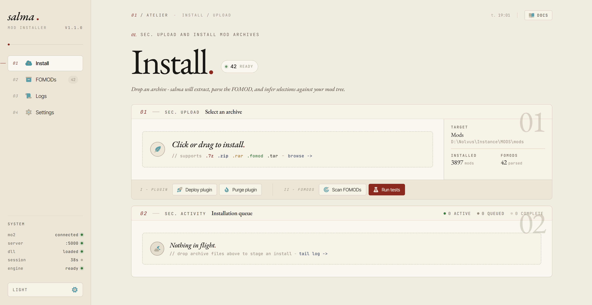
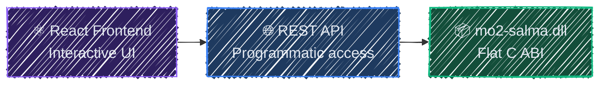
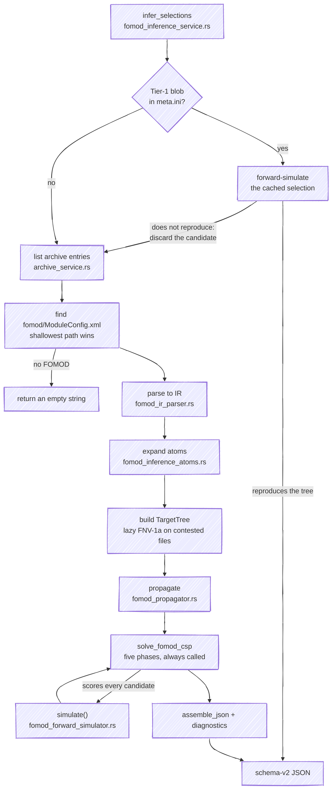
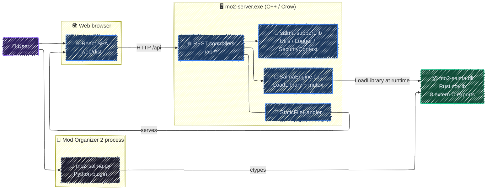
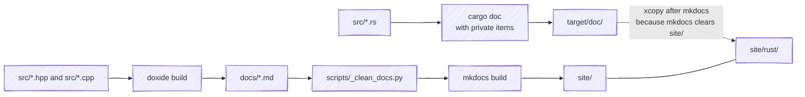

<div align="center">

# salma
**Wizardless FOMOD installer, processor, and selection inference engine**

🎀 [Features](#features) | 💃 [Quick Start](#quick-start) | 📘 [Documentation](#documentation) | 🤝 [Contributing](./CONTRIBUTING.md)

![ReactJS](https://img.shields.io/badge/React-TSX-149ECA.svg?style=flat&logo=)
![Crow](https://img.shields.io/badge/Crow-HTTP-D97706.svg?style=flat&logo=)
![Mo2](https://img.shields.io/badge/%20-MO2_Plugin-64748B.svg?style=flat&logo=)
![Tailwind](https://img.shields.io/badge/Tailwind-CSS-2DD4BF.svg?style=flat&logo=)


![License](https://img.shields.io/badge/License-MIT-475569.svg?logo=)
<br/>
[](https://sonarcloud.io/summary/new_code?id=lextpf_salma)
[](https://sonarcloud.io/summary/new_code?id=lextpf_salma)
[](https://sonarcloud.io/summary/new_code?id=lextpf_salma)
[](https://app.codacy.com/gh/lextpf/salma/dashboard?utm_source=gh&utm_medium=referral&utm_content=&utm_campaign=Badge_grade)
<br/>
[](https://github.com/lextpf/salma/actions/workflows/build.yml)
[](https://github.com/lextpf/salma/actions/workflows/lint.yaml)
[](https://github.com/lextpf/salma/actions/workflows/test.yml)
[](https://github.com/lextpf/salma/actions/workflows/eslint.yaml)
<br/>
![Sponsor](https://img.shields.io/static/v1?label=sponsor&message=%E2%9D%A4&color=ff69b4&logo=)
</div>

salma installs FOMOD mods without the wizard. Point it at an archive and an already-installed copy of that mod, and it recovers which options were originally selected, then replays that install anywhere else.

The engine is a Rust cdylib. It does archive reading, FOMOD XML processing, install replay and selection inference, and exposes all of it through one flat C ABI. Two hosts drive that ABI: a Python plugin inside Mod Organizer 2, and a Crow HTTP server in C++23 that serves a React dashboard.

Scope is deliberately narrow. salma reproduces FOMOD choices and prepares future installs; it is not a general-purpose mod installer and does not cover every archive format, scripted installer or package layout MO2 handles.

<div align="center">
<br>



</div>

> [!IMPORTANT]
> **Early release** - salma is under active development and has been tested against:
> - **Nolvus Ascension 6.0.20** with **350 FOMODs**.
> - Other mods should work without issues - if you run into a problem, please report it.

```
/* ============================================================================================== *
 *
 *       ::::::::      :::     :::        ::::    ::::      :::         ⢠⣤⣤⣀ ⠀⠀⠀⠀⠀⠀ ⣀⣤⣤⡄
 *      :+:    :+:   :+: :+:   :+:        +:+:+: :+:+:+   :+: :+:      ⢸⣿⣿⣿⣿⣦⣄⣀⣠⣴⣿⣿⣿⣿⡇⠀⊹
 *      +:+         +:+   +:+  +:+        +:+ +:+:+ +:+  +:+   +:+     ⣸⣿⣿⣿⣿⣿⡽⣿⣯⣿⣿⣿⣿⣿⣇
 *      +#++:++#++ +#++:++#++: +#+        +#+  +:+  +#+ +#++:++#++:    ⢻⣿⣿⣿⠿⣻⣵⡟⣮⣟⠿⣿⣿⣿⡟
 *             +#+ +#+     +#+ +#+        +#+       +#+ +#+     +#+    ⠀⠀⠀⠀⣼⣿⡿ ⠀⢿⣿⣷⡀
 *      #+#    #+# #+#     #+# #+#        #+#       #+# #+#     #+#    ⊹⠀⣠⣾⣿⣿⠃ ⠀⠈⢿⣿⣿⣦⡀
 *       ########  ###     ### ########## ###       ### ###     ###    ⠀⠈⠉⠹⡿⠁⠀⠀⠀⠀⠈⢻⡇⠉⠉
 *
 *                              << F O M O D   E N G I N E >>
 *
 * ============================================================================================== */
```

```
salma/
|-- .github/                              # GitHub config
|   |-- workflows/                        # build.yml, test.yml, sonar.yml, eslint.yaml
|   +-- ISSUE_TEMPLATE/                   # Bug / feature / task issue forms
|-- src/                                  # Both languages, side by side (see the note below)
|   |                                     # -- Rust engine: snake_case *.rs, crate mo2_salma_rs --
|   |-- lib.rs                            # Crate root; declares every engine module
|   |-- capi.rs                           # The eight extern "C" exports; the only ABI boundary
|   |-- types.rs                          # Shared engine types
|   |-- utils.rs                          # Strings, paths, FNV-1a, path-safety guards
|   |-- logger.rs                         # Rotating logs/salma.log + host callback
|   |-- json.rs                           # Owned JSON value model, schema-v2 output
|   |-- archive_service.rs                # Archive listing/extraction (zip, sevenz_rust2, unrar)
|   |-- archive_resolver.rs               # installationFile -> archive fallback chain
|   |-- file_operations.rs                # Queued, priority-sorted file operations
|   |-- mod_structure_detector.rs         # Non-FOMOD content-root detection
|   |-- installation_service.rs           # Top-level install orchestrator
|   |-- fomod_service.rs                  # FOMOD install replay
|   |-- fomod_dependency_evaluator.rs     # FomodCondition tree evaluation
|   |-- fomod_ir.rs                       # FOMOD IR types (Installer/Step/Group/Plugin)
|   |-- fomod_ir_parser.rs                # ModuleConfig.xml -> IR (roxmltree)
|   |-- fomod_atom.rs                     # Atom, AtomIndex, TargetTree types
|   |-- fomod_inference_atoms.rs          # Atom expansion and schema-v2 assembly
|   |-- fomod_propagator.rs               # Deterministic constraint propagation
|   |-- fomod_csp_solver.rs               # Five-phase CSP solve
|   |-- fomod_csp_types.rs                # Solver datatypes
|   |-- fomod_csp_precompute.rs           # Read-only solver precomputation
|   |-- fomod_csp_options.rs              # Per-group option enumeration, SelectAny caps
|   |-- fomod_forward_simulator.rs        # In-memory install replay used as scoring oracle
|   |-- fomod_inference_service.rs        # Inference entry point: infer_selections()
|   |-- inference_diagnostics.rs          # Per-decision reason codes and confidence
|   |                                     # -- C++ server: PascalCase *.hpp / *.cpp --
|   |-- main.cpp                          # Crow HTTP server entry point
|   |-- SalmaEngine.hpp/cpp               # LoadLibrary bridge to mo2-salma.dll
|   |-- Export.hpp                        # MO2_API export macro
|   |-- Types.hpp                         # Shared server type definitions
|   |-- Utils.hpp/cpp                     # String/path helpers the server still needs
|   |-- BackgroundJob.hpp                 # Async job runner (header-only)
|   |-- Logger.hpp/cpp                    # Thread-safe logging
|   |-- InstallationController.hpp/cpp    # REST endpoint handlers
|   |-- Mo2Controller.hpp/cpp             # MO2 dashboard controller (shared state)
|   |-- Mo2...Controller.cpp              # Per-subsystem endpoints (config/fomod/log/plugin/test)
|   |-- Mo2Helpers.hpp/cpp                # Shared helpers for MO2 controllers
|   |-- ConfigService.hpp/cpp             # Configuration management
|   |-- MultipartHandler.hpp/cpp          # Form data parsing
|   |-- StaticFileHandler.hpp/cpp         # SPA serving
|   |-- SecurityContext.hpp/cpp           # CSRF token + Origin allowlist
|   +-- SecurityMiddleware.hpp/cpp        # Crow Origin/CSRF enforcement
|-- web/                                  # React frontend (Vite + TypeScript)
|   |-- src/                              # TSX pages, hooks, and comps/ components
|   |-- dist/                             # Built SPA (served by Crow)
|   |-- index.html                        # Vite entry HTML
|   |-- package.json                      # Dependencies and scripts
|   |-- tsconfig.json                     # TypeScript config
|   |-- eslint.config.js                  # ESLint config (max-warnings 0)
|   +-- vite.config.ts                    # Dev proxy to :5000
|-- tests/                                # Both languages: cargo picks up *.rs, CMake *.cpp
|   |-- inference_diagnostics_test.rs     # Rust integration test: diagnostics reason codes
|   |-- salma_engine_test.cpp             # GoogleTest: the SalmaEngine DLL bridge
|   |-- security_context_test.cpp         # GoogleTest: CSRF / Origin allowlist
|   +-- utils_test.cpp                    # GoogleTest: shared utilities
|-- scripts/                              # MO2 plugin, packaging & utilities
|   |-- mo2-salma.py                      # MO2 Python plugin
|   |-- common.py                         # Shared utilities
|   |-- install.py                        # Installation helper
|   |-- compare.py                        # Round-trip diff utility
|   |-- scan.py                           # Mod scanning utility
|   |-- package.py                        # Stage the deployable mo2-salma.dll
|   |-- smoke_ctypes.py                   # Raw C ABI smoke test
|   |-- smoke_plugin.py                   # MO2 plugin-loader smoke test
|   |-- run_harness.py                    # Round-trip harness against a live MO2
|   |-- _clean_docs.py                    # Doc post-processing
|   +-- _promote_subgroups.py             # Orphaned doc-layout tool; no pipeline runs it
|-- cmake/                                # vcpkg overlay triplet
|   +-- x64-windows-static-md.cmake       # Static-md triplet definition
|-- docs/                                 # Generated API docs (only main.html is checked in)
|   +-- main.html                         # MkDocs theme override
|-- .clang-format                         # clang-format rules (Google-based)
|-- .clang-tidy                           # clang-tidy rules (run by hand)
|-- .clangd                               # clangd language-server config
|-- .gitattributes                        # Git attributes
|-- .gitignore                            # Git ignore rules
|-- Cargo.toml                            # Rust crate manifest (cdylib + rlib)
|-- Cargo.lock                            # Pinned Rust dependency graph
|-- build.rs                              # Cargo build script
|-- CMakeLists.txt                        # C++ build (salma-support, mo2-server, salma_tests)
|-- CMakePresets.json                     # Build presets (vcpkg)
|-- vcpkg.json                            # C++ dependency manifest (Crow, nlohmann-json, gtest)
|-- sonar-project.properties              # SonarCloud configuration
|-- doxide.yml                            # C++ API doc config
|-- mkdocs.yml                            # Documentation site config
|-- setup.bat                             # Persist SALMA_* env vars (one-time setup)
|-- build.bat                             # Build pipeline (engine + server + web + docs)
|-- run.bat                               # Run the dashboard (server :5000 + Vite :3000)
|-- deploy.bat                            # Deploy to MO2
|-- purge.bat                             # Remove plugin & clean output
|-- test.bat                              # Rust suite + the two ABI smoke tests
|-- test_all.py                           # Round-trip test runner (Python)
|-- test_one.py                           # Round-trip test for a single mod
|-- AGENTS.md                             # Agent/contributor working notes
|-- CLAUDE.md                             # Claude Code project instructions
|-- CONTRIBUTING.md                       # Contributor guide
|-- PARITY-NOTES.md                       # Why the engine's odd-looking behaviors are deliberate
|-- CUTOVER.md                            # Deploying the engine DLL, and rolling back
|-- LICENSE.md                            # License
|-- README.md                             # This file
+-- PREVIEW.png                           # README banner image
```

> [!NOTE]
> `src/` and `tests/` hold both languages on purpose. In `src/`, snake_case `.rs`
> files are the engine and PascalCase `.hpp`/`.cpp` pairs are the server. In
> `tests/`, cargo picks up `*.rs` and CMake picks up `*.cpp`; neither build sees
> the other's files.

## Features

### Interface

Three layers, each sitting on the one below it: the engine DLL behind a flat C ABI for direct integration, a REST API for programmatic access, and a React web UI for interactive FOMOD processing and install replay.


```mermaid
---
config:
  look: handDrawn
  theme: mc
  themeVariables:
    fontSize: 18px
  layout: elk
---
graph LR
    classDef dll fill:#134e3a,stroke:#10b981,color:#e2e8f0
    classDef api fill:#1e3a5f,stroke:#3b82f6,color:#e2e8f0
    classDef web fill:#2e1f5e,stroke:#8b5cf6,color:#e2e8f0

    Web["⚛️ React Frontend<br/>Interactive UI"]:::web
    API["🌐 REST API<br/>Programmatic access"]:::api
    DLL["📦 mo2-salma.dll<br/>Flat C ABI"]:::dll

    Web --> API --> DLL
```

### FOMOD Processing


```mermaid
---
config:
  look: handDrawn
  theme: mc
  themeVariables:
    fontSize: 18px
  layout: elk
---
graph LR
    classDef parse fill:#7c2d12,stroke:#f97316,color:#fef3c7
    classDef eval fill:#4c1d95,stroke:#e879f9,color:#e2e8f0
    classDef ops fill:#064e3b,stroke:#34d399,color:#e2e8f0
    classDef detect fill:#713f12,stroke:#facc15,color:#fef9c3

    P["📄 XML Parser"]:::parse
    D["🧩 Dependency Evaluator"]:::eval
    F["📂 File Operations"]:::ops
    S["🔎 Structure Detector"]:::detect

    P --- D --- F --- S
```

- 📄 **XML Parser** - Parses `fomod/ModuleConfig.xml` for installation steps and options
- 🧩 **Dependency Evaluator** - Resolves flag-based and file-based FOMOD dependencies
- 📂 **File Operations** - Priority-sorted file copy, folder creation, and patching
- 🔎 **Structure Detector** - Identifies candidate content roots inside archives (meshes/, textures/, SKSE/, etc.)

### Inference Engine

Inference compares an archive's FOMOD options against an already-installed mod and recovers which selections were originally chosen. Walking every permutation of steps, groups and flags is intractable on large installers, so the pipeline is a layered solver instead. The single entry point is `infer_selections(archive_path, mod_path)` in `src/fomod_inference_service.rs`. It returns schema-v2 JSON, or an empty string on any failure: no error type can cross the C ABI.


```mermaid
---
config:
  look: handDrawn
  theme: mc
  themeVariables:
    fontSize: 16px
---
flowchart TD
    A["infer_selections<br/>fomod_inference_service.rs"] --> B{"Tier-1 blob<br/>in meta.ini?"}
    B -- yes --> C["forward-simulate<br/>the cached selection"]
    C -- "reproduces the tree" --> Z["schema-v2 JSON"]
    C -- "does not reproduce:<br/>discard the candidate" --> D
    B -- no --> D["list archive entries<br/>archive_service.rs"]
    D --> E["find fomod/ModuleConfig.xml<br/>shallowest path wins"]
    E -- "no FOMOD" --> X["return an empty string"]
    E --> F["parse to IR<br/>fomod_ir_parser.rs"]
    F --> G["expand atoms<br/>fomod_inference_atoms.rs"]
    G --> H["build TargetTree<br/>lazy FNV-1a on contested files"]
    H --> I["propagate<br/>fomod_propagator.rs"]
    I --> J["solve_fomod_csp<br/>five phases, always called"]
    J -- "scores every candidate" --> K["simulate()<br/>fomod_forward_simulator.rs"]
    K --> J
    J --> L["assemble_json + diagnostics"]
    L --> Z
```

- ⚡ **Tier-1 candidate** - reads a cached fomod-plus JSON blob from `meta.ini` when present. It is a candidate, not a shortcut: the blob is forward-simulated and kept only when it reproduces the installed tree, otherwise it is discarded and the full pipeline runs. It hits on a large fraction of mods installed by a user who already ran the wizard once.
- 🧮 **Constraint propagator** - a deterministic pre-pass that narrows each group's plugin domain using plugin-type rules (`Required` / `NotUsable` / `SelectAll`), file-evidence elimination, and cardinality. Fully resolved groups are seeded into the solver, which short-circuits them internally. The service always calls the solver; it never branches on `fully_resolved` itself.
- 🧠 **5-phase CSP solver** - Phase 1 (greedy -> iterative local search -> first targeted repair) -> Phase 2 (independent-component decomposition) -> Phase 3 (near-perfect residual repair, m=0 and e=0) -> Phase 4 (mismatch-focused search and backtrack) -> Phase 5 (global fallback with widening `SelectAny` caps: narrow -> medium -> full). Each phase short-circuits on an exact reproduction.
- 🪞 **Forward simulator** - replays a candidate selection against the IR in memory and scores the simulated tree against the target with a five-key lexicographic order: `(missing, extra, size_mismatch, hash_mismatch, -reproduced)`. It resolves conflicts by the same priority and document order as the real installer, which is what makes its verdict trustworthy.
- 📋 The output is a JSON configuration that reproduces the original install, and the same file drives the round-trip test suite.

### MO2 Integration

- 🐍 **Python Plugin** - `mo2-salma.py` loads the DLL via ctypes and exposes tools inside MO2
- 🔬 **Scan FOMOD Choices** - Batch-scans all installed mods for FOMOD selections
- 📁 **Centralized Output** - Inferred FOMOD choices are written as one JSON file per mod, keyed by mod name, into a dedicated "Salma FOMODs Output" mod folder (`<mods>/Salma FOMODs Output/fomods/<mod name>.json`). Only the choices land there. Reinstalled mod files go into the mod directory MO2 creates.
- ⚡ **Deploy & Purge** - `deploy.bat` and `purge.bat` scripts for plugin lifecycle management

### Archive Support

`src/archive_service.rs` picks a backend by file extension:

|  Extension     | Backend crate                                                  |
|----------------|----------------------------------------------------------------|
| `.7z`, `.001`  | `sevenz_rust2`                                                  |
| `.rar`         | `unrar` (links the proprietary unRAR C sources)                 |
| anything else  | `zip` (this is the fallback, so `.zip` and unknown names land here) |

> [!WARNING]
> There is no TAR backend. `.tar`, `.tar.gz`, `.tar.bz2`, `.tar.xz` and `.tar.zst`
> fall through to the `zip` backend, which cannot read them. The listing and read
> paths report failure as an empty result rather than an error, so such an archive
> looks like an archive with no entries.

### Additional Capabilities

- 🌐 **REST API** - Full programmatic access for custom FOMOD tooling and automation
- 🎨 **Web UI** - React SPA with dark/light theme, served directly by the Crow backend
- 📝 **Logging** - Unified thread-safe logger with subsystem tags; 10 MiB rotation, up to 3 archived files
- 🧪 **Round-Trip Testing** - Infer selections, replay a FOMOD install, and diff against the original mod

### Scope

Everything above is about FOMOD packages: parsing `fomod/ModuleConfig.xml`, evaluating dependencies, inferring selected options from an existing install, and replaying those choices. An archive with no FOMOD but a recognizable content root gets a plain copy instead, which is a convenience, not a claim of mod-manager compatibility. MO2 stays the tool for installer formats and scripted flows salma does not model.

### Limits

The deliberate guardrails are:

- 📦 **256 MiB per-archive-entry cap** (`MAX_ENTRY_SIZE` in `src/archive_service.rs`) - the in-memory read paths reject any entry whose header uncompressed size exceeds the cap before allocating, which guards against zip / 7z decompression bombs. The same value also clamps the `Vec::with_capacity` hint, so a forged header size cannot force an unbounded pre-allocation.
- 📤 **8 GiB upload cap** (`kMaxUploadBytes` in `InstallationController::parse_and_validate_upload`) - oversized multipart uploads return HTTP 413 before any temp-file write. Crow's own stream threshold in `main.cpp` is set to the same value on purpose.
- 🛡️ **Path-traversal rejection** in the extraction path of `src/archive_service.rs`, through `utils::is_inside` - any entry whose canonical destination falls outside the extraction root is skipped before write and logged as `[archive] Skipping path-traversal entry`.
- 🚫 **Shell-metachar sanitization** by `path_contains_shell_metachar` in `src/Mo2PluginController.cpp`, on the shared path behind `Mo2Controller::deploy_plugin` and `purge_plugin` - blocks `& | > < ^ % ! ( ) " ; ' \`` in the deploy and mods paths before they flow into a `cmd.exe` child process. It is a denylist on purpose: these are real user directory paths, and an allowlist would reject legitimate names.
- ✅ **Whitelist regex on `run_tests` args** (`src/Mo2TestController.cpp`) - `^[a-zA-Z0-9 _\-\.]*$`; quotes and path separators are excluded, and the literal `..` substring is rejected even within the whitelist.

## Technology Stack

| Component       | Technology                                              |
|-----------------|---------------------------------------------------------|
| Engine language | Rust, edition 2024, toolchain 1.85+ (crate `mo2_salma_rs`) |
| Server language | C++23                                                   |
| HTTP Framework  | Crow (behind a custom Origin/CSRF middleware)           |
| Frontend        | React 18 + TypeScript + Vite                            |
| Styling         | Tailwind CSS 4                                          |
| XML Parsing     | roxmltree (engine)                                      |
| JSON            | serde_json (engine) + nlohmann-json (server)            |
| Archive         | zip + sevenz_rust2 + unrar (engine)                     |
| Formatting      | cargo fmt (Rust), clang-format (C++, Google-based)      |
| Build System    | Cargo (engine) + CMake 3.20+ (server)                   |
| Package Manager | cargo (engine) + vcpkg (server)                         |
| Documentation   | rustdoc (engine) + Doxide/MkDocs (C++)                  |
| Plugin          | Python 3 (MO2 ctypes bridge)                            |
| CI/CD           | GitHub Actions                                          |
| Platform        | Windows 10/11 (64-bit)                                  |

## Quick Start

### Prerequisites

Required for any build:

- **Windows 10/11** (64-bit)
- **Rust toolchain** via [rustup](https://rustup.rs), 1.85 or later - `build.bat` checks for `cargo` first and exits immediately when it is missing. Every other tool below only skips a step.
- **Visual Studio 2022** (MSVC v143, C++23) - cargo needs the MSVC linker and C compiler on `x86_64-pc-windows-msvc`, and the `unrar` crate compiles C sources with it.

Required only for the C++ server half:

- **CMake 3.20+**
- **vcpkg** - set `VCPKG_ROOT`; the default CMake preset reads it directly. The build uses the **`x64-windows-static-md`** triplet;
the manifest in `vcpkg.json` pins versions, so the first configure may take several minutes while vcpkg builds the cache. Without `VCPKG_ROOT`, `build.bat` skips the server and `run.bat` then cannot find `mo2-server.exe`.

Required only for the dashboard and the tooling:

- **Node.js** - builds the React frontend; without `npm`, `build.bat` skips `web/dist`.
- **Python 3** - the MO2 plugin, `scripts/package.py`, the smoke tests, and documentation post-processing.
- **clang-format** (optional, for C++ formatting; no build step or workflow invokes it, so run it by hand)
- **doxide** + **mkdocs** (optional, for the C++ half of the API docs; rustdoc ships with the Rust toolchain and always runs)

### Building

```powershell
# 1. Clone the repository
git clone https://github.com/lextpf/salma.git
cd salma

# 2. Build (format + configure + compile + docs)
.\build.bat

# 3. Run the server
.\build\bin\Release\mo2-server.exe
```

Output:
- Engine: `target/release/mo2_salma_rs.dll`, staged as `target/package/mo2-salma.dll`. The rename is done by `scripts/package.py`, deliberately as a separate auditable step. `target/package/mo2-salma.dll` is the file to deploy, and it is what `build.bat` prints.
- Server: `build/bin/Release/mo2-server.exe`
- Engine copy beside the server: `build/bin/Release/mo2-salma.dll`. This is a convenience copy of the staged engine that CMake refreshes only when the C++ is rebuilt, so it can be older than the engine you just built. `run.bat` byte-compares the two and warns.
- Web UI: `web/dist/`

`build.bat` builds only the `mo2-server` target, so `salma_tests.exe` is not produced. Build it explicitly (see [Testing](#testing)).

For a faster iteration loop, build one half at a time:

```powershell
# Engine only
cargo build --release                                      # -> target\release\mo2_salma_rs.dll
python scripts\package.py --no-build                       # stage it as mo2-salma.dll + sha256

# Server only (configure once; the preset reads VCPKG_ROOT)
cmake --preset default
cmake --build build --config Release --target mo2-server   # EXE only
cmake --build build --config Release --target salma_tests  # C++ unit-test binary only
```

`build.bat` runs seven steps: `cargo fmt`, `cargo clippy` (`-D warnings`), a Release build of the engine, `scripts/package.py` to stage the deployable DLL, a CMake build of `mo2-server.exe`, `npm run build` for the dashboard, and the documentation pipeline. Steps 4-7 skip cleanly when their toolchain is absent (`python`, `cmake`/`VCPKG_ROOT`, `npm`, `doxide`/`mkdocs`); the cargo steps and the rustdoc lint gate are always fatal.

### Frontend development

The React SPA in `web/` builds into `web/dist/` and is served by `mo2-server.exe`. For interactive development use Vite's dev server, which proxies `/api/*` requests through to the C++ backend:

```powershell
cd web
npm install    # one-time
npm run dev    # Vite dev server on :3000, proxies /api -> :5000
npm run build  # outputs to web/dist/, served by Crow at :5000
npm run lint   # eslint, max-warnings=0
```

> [!IMPORTANT]
> Start `mo2-server.exe` on `:5000` **before** `npm run dev`. Vite's proxy assumes the backend is already up; if it isn't, every `/api/*` request the SPA makes will fail with a proxy error and the UI will look broken.

`.\run.bat` from the repo root does both in order: it launches the server and the Vite dev server in their own windows, waits for each port to answer, then opens `http://localhost:3000`. It builds nothing, so run `.\build.bat` first - that produces all three artifacts the dashboard needs.

> [!NOTE]
> The script is `run.bat`, not `start.bat`: `start` is a cmd built-in and a PowerShell alias for `Start-Process`, so typing `start` would never reach it. Typing `run` resolves to `run.bat`, the same way `build` resolves to `build.bat`.

### Deploying to MO2

```powershell
# Copy DLL + Python plugin to your MO2 instance
.\deploy.bat
```

`deploy.bat` **requires** `SALMA_DEPLOY_PATH`. It computes nothing: an unset variable is a hard error and the script exits 1. Run `.\setup.bat` once to set it.

The two files go to two different places:

| File | Destination |
|------|-------------|
| `mo2-salma.dll` | `%SALMA_DEPLOY_PATH%\salma\mo2-salma.dll` (the `salma\` subdirectory, created if absent) |
| `mo2-salma.py`  | `%SALMA_DEPLOY_PATH%\mo2-salma.py` |

The nesting is load-bearing. `<plugin dir>/salma` is the plugin's first DLL search candidate, so a DLL placed flat beside the `.py` gives a plugin that cannot find its engine.

`purge.bat` removes them again.

Only the server derives a deploy path from the mods path: `resolve_deploy_path` in `src/Mo2Helpers.cpp` uses `SALMA_DEPLOY_PATH` when set and otherwise walks `<mods_path>/../../MO2/plugins`. That fallback backs the dashboard's deploy endpoint alone; `deploy.bat` never guesses.

## Configuration & Environment

salma reads a small set of environment variables. None are required to build the engine; each one enables a specific half of the project or a specific workflow.

| Variable               | Purpose                                                                         | Read by                                          |
|------------------------|---------------------------------------------------------------------------------|--------------------------------------------------|
| `VCPKG_ROOT`           | vcpkg toolchain path used by the default CMake preset. Unset means `build.bat` skips the server. | `CMakePresets.json`, `build.bat`  |
| `SALMA_BIND_ADDR`      | Override the default loopback bind. Non-loopback values log a security warning. | `main.cpp`                                       |
| `SALMA_MODS_PATH`      | MO2 mods directory. Feeds the server's deploy fallback chain and the round-trip tests; `purge.bat` requires it. | `Mo2Helpers.cpp`, `purge.bat`, `scripts/common.py` |
| `SALMA_DEPLOY_PATH`    | MO2 plugins directory. Required by `deploy.bat` and `purge.bat`.                | `Mo2Helpers.cpp`, `deploy.bat`, `purge.bat`, `scripts/common.py` |
| `SALMA_DOWNLOADS_PATH` | Lookup root for `resolve_mod_archive` when `installationFile` is relative.      | `archive_resolver.rs`, `InstallationController.cpp`, `scripts/common.py` |
| `CARGO_BUILD_JOBS`     | Cargo parallelism. `build.bat` and `test.bat` default it to **4** when unset, because one job per core has taken the toolchain down on high-core hosts (rustc `STATUS_HEAP_CORRUPTION`, cc-rs failures building the unrar sources). Set it to override. | `build.bat`, `test.bat` |
| `SALMA_NO_PAUSE`       | Set to `1` to suppress the trailing `pause`. Set it when running the scripts non-interactively, for example from CI. | `test.bat`, `deploy.bat`, `purge.bat`, `setup.bat` |

The three `SALMA_*` path variables are not enforced the same way:

- `SALMA_MODS_PATH` and `SALMA_DEPLOY_PATH` are checked at import by `scripts/common.py`, which prints a setup hint and exits 2 when either is missing.
- `SALMA_DOWNLOADS_PATH` is optional and degrades silently. Without it a relative `installationFile` value cannot resolve, and `test_all.py` reports those mods as `SKIP (archive not found)`. That reads like a corpus problem and is a configuration problem.

One helper sets all three:

```powershell
.\setup.bat   # sets the three SALMA_* vars via setx (persists across shells)
```

`ConfigService` persists the runtime-configurable settings (currently just the MO2 mods directory) to `salma.json` next to `mo2-server.exe`. The dashboard's `PUT /api/config` endpoint writes that file with a write-then-rename, so a partial write cannot corrupt it. The FOMOD output directory is derived from the mods path as `<mo2ModsPath>/Salma FOMODs Output/fomods/` and cannot be configured separately.

## Testing

There are three test layers; treat them as separate workflows.

### Rust suite + ABI smoke tests

```powershell
.\test.bat
```

`test.bat` runs three steps and never invokes CMake:

1. `cargo test --release` - the whole engine suite, unit and integration.
2. `python scripts\smoke_ctypes.py target\release\mo2_salma_rs.dll` - the raw C ABI surface through ctypes.
3. `python scripts\smoke_plugin.py` - the MO2 plugin's own `find_dll` / `load_dll` / `_configure_dll` / `_check_api_version`, run verbatim against the packaged DLL. It stages the DLL first when `target\package\mo2-salma.dll` is absent.

Steps 2 and 3 skip when `python` is missing. Step 2 fails when `target\release\mo2_salma_rs.dll` is absent, so run `build.bat` or `cargo build --release` first.

To run part of the Rust suite directly:

```powershell
cargo test --release -- utils::                          # one module's unit tests
cargo test --release --test inference_diagnostics_test   # the only Rust integration test file
```

### C++ unit tests (GoogleTest)

`.\test.bat` neither builds nor runs these. They have their own target:

```powershell
cmake --build build --config Release --target salma_tests
.\build\bin\Release\salma_tests.exe --gtest_filter=SalmaEngine.*
ctest --preset ci                                        # what test.yml runs
```

Sources are the `*.cpp` files under `tests/`. There is no glob and no `tests/CMakeLists.txt`: a new test file is invisible to the build until it is added to the explicit source list in `add_executable(salma_tests ...)` in the root `CMakeLists.txt`. In CI these run only in `test.yml`, and only on `main`.

### Round-trip integration tests (Python)

```powershell
python scripts\run_harness.py        # test_all.py with the stale-DLL trap handled
python test_all.py                   # walks every mod under SALMA_MODS_PATH
python test_one.py <archive> <mod>   # single-mod variant for debugging
```

`test_all.py` enumerates every mod folder under `SALMA_MODS_PATH`, infers FOMOD selections through the DLL, reinstalls the result into a temporary directory, and diffs the produced file tree against the original install.

Output lands in two different places:

- `test.log`, written next to `test_all.py`.
- `logs/salma.log`, written by the engine beside whichever DLL was loaded. On a dev box `scripts/common.py::find_dll` searches `%SALMA_DEPLOY_PATH%\salma\` first, so that is usually the deployed build's directory, not the repo; under `scripts/run_harness.py` it is the staging tree. The repo root never holds a `logs/salma.log`, so finding none there does not mean logging is broken.

> [!IMPORTANT]
> `find_dll` prefers the deployed DLL, so a plain `python test_all.py` can validate a binary you did not just build. `scripts/run_harness.py` closes that hole: it stages the DLL under test, redirects `SALMA_DEPLOY_PATH` for the child process only, and re-hashes the file the harness reports loading.

These tests need `SALMA_MODS_PATH` and `SALMA_DEPLOY_PATH` (enforced, exit 2 when unset) and in practice also `SALMA_DOWNLOADS_PATH`, as described in [Configuration & Environment](#configuration--environment). Run `setup.bat` once to set all three via `setx`.

## Architecture

One engine, two hosts. The engine is `mo2-salma.dll`, a Rust cdylib that owns all FOMOD parsing, inference and install replay. Both hosts, the MO2 Python plugin and `mo2-server.exe`, drive it through the same eight `extern "C"` exports declared in `src/capi.rs`. The React SPA is a third artifact and talks only to the server.


```mermaid
---
config:
  look: handDrawn
  theme: mc
  themeVariables:
    fontSize: 18px
  layout: elk
---
graph LR
    classDef host fill:#1e1e2e,stroke:#94a3b8,color:#e2e8f0,stroke-dasharray:6 4
    classDef artifact fill:#1e3a5f,stroke:#3b82f6,color:#e2e8f0
    classDef core fill:#134e3a,stroke:#10b981,color:#e2e8f0
    classDef user fill:#2e1f5e,stroke:#8b5cf6,color:#e2e8f0

    User["👤 User"]:::user

    subgraph MO2["🧩 Mod Organizer 2 process"]
        Plugin["🐍 mo2-salma.py<br/>Python plugin"]:::host
    end

    subgraph Browser["🌍 Web browser"]
        SPA["⚛️ React SPA<br/>web/dist"]:::artifact
    end

    subgraph SrvHost["🖥️ mo2-server.exe (C++ / Crow)"]
        Server["🌐 REST controllers<br/>/api/*"]:::artifact
        Static["📄 StaticFileHandler"]:::artifact
        Bridge["🔌 SalmaEngine.cpp<br/>LoadLibrary + mutex"]:::artifact
        Support["🧰 salma-support.lib<br/>Utils / Logger / SecurityContext"]:::artifact
    end

    Engine["📦 mo2-salma.dll<br/>Rust cdylib<br/>8 extern C exports"]:::core

    User --> Plugin
    User --> SPA
    Plugin -- "ctypes" --> Engine
    SPA -- "HTTP /api" --> Server
    Static -- "serves" --> SPA
    Server --- Static
    Server --> Bridge
    Server --> Support
    Bridge -- "LoadLibrary at runtime" --> Engine
```

### The artifacts

- **📦 `mo2-salma.dll` - the engine.** Built by cargo, not CMake, from the Rust crate at the repo root. The cargo output is `target/release/mo2_salma_rs.dll`; `scripts/package.py` renames it to `mo2-salma.dll` under `target/package/`. The rename is a separate explicit step, so a file under the deploy name has provably been through it. The DLL has no HTTP, no UI and no Crow dependency. Use it when you want FOMOD selection inference or replay without the wizard.

- **🌐 `mo2-server.exe` - the HTTP host.** Built from the `mo2-server` CMake target. It links `salma-support` (a small static library of `Utils`, `Logger` and `SecurityContext`), Crow and nlohmann-json, and no engine library at all: it loads `mo2-salma.dll` at runtime through `src/SalmaEngine.cpp`. It exposes the install / infer / scan / status / log endpoints under `/api/*`, serves the React SPA from `web/dist/` at `/`, and listens on `:5000`. Use it when you want a graphical interface or REST access.

- **⚛️ `web/dist/` - the browser front-end.** Built with Vite from `web/src/`. Pure HTML/CSS/JS. It talks to `mo2-server.exe` over `fetch('/api/...')` and knows nothing about the engine. Use it to drive an installation interactively, browse FOMOD JSON files, or watch logs in real time.

> [!IMPORTANT]
> The server loads the engine instead of linking it, so `mo2-server.exe` and `mo2-salma.dll` are separate files that can drift to different versions. CMake refreshes the copy beside the exe only when the C++ is rebuilt, so a plain `build.bat` can leave the dashboard on an old engine. `run.bat` byte-compares `build\bin\Release\mo2-salma.dll` against `target\package\mo2-salma.dll` and warns on a mismatch.

### The C ABI is the only boundary

`src/capi.rs` exports exactly eight symbols, and both hosts go through them:

`install`, `installWithConfig`, `inferFomodSelections`, `resolveModArchive`, `setLogCallback`, `getApiVersion`, `installSucceeded`, `freeResult`.

Neither host can drift from the other, so one improvement to inference reaches the MO2 plugin and the dashboard together.

Every non-null string return except `getApiVersion` is heap-allocated by the engine and must be released with `freeResult`. No panic may unwind across the boundary; every export routes through an internal guard.

`src/SalmaEngine.cpp` restores two behaviors the flat ABI erases. A failed install throws `std::runtime_error`, because the Crow controllers catch `std::exception` while the ABI only returns an error string plus a false `installSucceeded()`. Install calls are mutex-serialized, because `installSucceeded()` is a process-global flag while the server runs installs on overlapping background jobs. `tests/salma_engine_test.cpp` covers both.

### Two ways salma is used

**Path A - inside Mod Organizer 2 (no server, no browser).**

1. `deploy.bat` copies the engine to `<plugins>/salma/mo2-salma.dll` and the plugin to `<plugins>/mo2-salma.py`. Note the two destinations differ.
2. MO2 starts and Python loads `mo2-salma.py`.
3. The plugin loads the DLL via `ctypes`, searching `<plugin dir>/salma` first.
4. When the user processes a FOMOD archive the plugin calls `installWithConfig()`; batch scans call `inferFomodSelections()`.
5. Results return as JSON or path strings; the plugin renders them in MO2's tools menu and writes the inferred choices into the "Salma FOMODs Output" mod folder.

**Path B - the standalone server with the web UI.**

1. The user runs `mo2-server.exe` (port 5000).
2. The browser opens `http://localhost:5000` and the server's static handler returns `web/dist/index.html`.
3. The React SPA loads, then calls endpoints like `POST /api/installation/upload` for file uploads or `GET /api/mo2/fomods/scan/status` for background-job progress.
4. The Crow controllers translate those requests into `SalmaEngine` calls, which are the same eight exports the plugin uses.
5. Results come back as JSON; the SPA renders progress, logs, and FOMOD trees.

### File-to-purpose drill-down

**Engine (Rust, crate `mo2_salma_rs`)**

|                            File | Purpose                                                     |
|---------------------------------|-------------------------------------------------------------|
| `src/capi.rs`                   | The eight `extern "C"` exports; the only ABI boundary        |
| `src/installation_service.rs`   | Top-level install orchestrator (extract, detect, dispatch)   |
| `src/archive_service.rs`        | Archive listing and extraction (zip, sevenz_rust2, unrar)    |
| `src/archive_resolver.rs`       | `installationFile` to archive fallback chain                 |
| `src/fomod_service.rs`          | FOMOD install replay and file-operation execution            |
| `src/fomod_ir_parser.rs`        | `ModuleConfig.xml` to the FOMOD IR (roxmltree)               |
| `src/fomod_inference_service.rs`| Infers FOMOD selections from installed files                 |
| `src/fomod_propagator.rs`       | Deterministic constraint propagation before the solve        |
| `src/fomod_csp_solver.rs`       | Five-phase CSP solve over the group/plugin grid              |
| `src/fomod_forward_simulator.rs`| In-memory install replay used to score candidates            |
| `src/fomod_dependency_evaluator.rs` | Evaluates FOMOD flag and file dependency trees           |
| `src/file_operations.rs`        | Priority-sorted file copy and patching                       |
| `src/mod_structure_detector.rs` | Detects candidate archive content roots for non-FOMOD copies |
| `src/logger.rs`                 | Rotating file log plus the host callback                     |

**Server (C++, namespace `mo2server`; the `salma-support` helpers are namespace `mo2core`)**

|                       File | Purpose                                                       |
|----------------------------|----------------------------------------------------------------|
| `src/main.cpp`             | Crow HTTP server entry point, middleware, routes, bind         |
| `src/SalmaEngine.cpp`      | The only place the server knows the engine is a DLL            |
| `src/InstallationController.cpp` | `/api/installation/upload`, `install`, `status/<id>`      |
| `src/Mo2Controller.cpp` and `src/Mo2*Controller.cpp` | `/api/config`, `/api/mo2/*`, `/api/logs*`, `/api/plugin/*`, `/api/test/*` |
| `src/SecurityMiddleware.cpp` | Origin allowlist and `X-Salma-Csrf` enforcement              |
| `src/StaticFileHandler.cpp`| Serves `web/dist` with SPA index.html fallback                 |
| `src/ConfigService.cpp`    | Reads/writes `salma.json` beside the exe, write-then-rename    |
| `src/Logger.cpp`           | Thread-safe logging with callback support                      |

## Documentation

`build.bat` step 7 generates everything. The two halves of the codebase use
different generators, because the engine is Rust and doxide cannot read it:

| Half | Generator | Output |
| --- | --- | --- |
| Rust engine (`src/*.rs`, ~29k LOC) | `rustdoc` | `site/rust/mo2_salma_rs/` |
| C++ server (`src/*.{hpp,cpp}`, ~7k LOC) | doxide -> `_clean_docs.py` -> mkdocs | `site/` |

The mkdocs landing page at `site/index.html` links across to the engine API, so
`site/index.html` is the single entry point.


```mermaid
---
config:
  look: handDrawn
  theme: mc
  themeVariables:
    fontSize: 16px
---
flowchart LR
    RS["src/*.rs"] --> RD["cargo doc<br/>with private items"] --> TD["target/doc/"]
    CPP["src/*.hpp and src/*.cpp"] --> DX["doxide build"] --> MD["docs/*.md"]
    MD --> CL["scripts/_clean_docs.py"] --> MK["mkdocs build"] --> SITE["site/"]
    TD -. "xcopy after mkdocs<br/>because mkdocs clears site/" .-> RUST["site/rust/"]
    SITE --- RUST
```

The dashed edge is ordering-critical: `mkdocs build` clears `site/`, so the
rustdoc copy has to land after it, never before.

To run the pipeline by hand:

```powershell
# 1. Rust engine API. --document-private-items is required: this crate's module
#    docs explain internals and link to private helpers.
cargo doc --no-deps --release --document-private-items

# 2. Generate markdown from C++ headers
doxide build

# 3. Post-process (strip noise, fix formatting, inject the Rust cross-link)
python scripts/_clean_docs.py

# 4. Build the documentation site. This clears site/ first, so it must run
#    before the copy below, not after.
mkdocs build

# 5. Stage the rustdoc output inside the site
xcopy /e /i /q /y target\doc site\rust
```

Serve locally with `mkdocs serve` for the C++ half; the Rust half is static HTML
and opens directly from `site/rust/mo2_salma_rs/index.html`.

Rustdoc lints are a build gate. `Cargo.toml`'s `[lints.rustdoc]` denies
`broken_intra_doc_links` and `redundant_explicit_links`, so a dead `[` `Foo` `]`
link fails `build.bat` the way a clippy warning does.

`docs/` is doxide's output directory and is regenerated, never edited. It is not
cleaned automatically, so when changing `doxide.yml` groups or the `mkdocs.yml`
nav, wipe it first (keeping `docs/main.html`) and rebuild. Stale pages left in
`docs/` will satisfy nav entries that a fresh clone cannot.

## Contributing

Contributions are welcome! Please read the [Contributing Guidelines](CONTRIBUTING.md) before submitting pull requests.

### Development Workflow

1. Fork the repository
2. Create a feature branch (`git checkout -b feature/amazing-feature`)
3. Make your changes
4. Run `.\test.bat` and make sure `.\build.bat` passes
5. Commit with descriptive messages
6. Push to your fork and open a Pull Request

## License

This project is licensed under the MIT License - see the [LICENSE](LICENSE.md) file for details.

## Acknowledgments

- [MO](https://github.com/ModOrganizer2/modorganizer) - Mod Organizer for managing mod collections
- [Crow](https://crowcpp.org/) - C++ HTTP framework
- [React](https://react.dev/) - Frontend UI library
- [zip](https://github.com/zip-rs/zip2) - ZIP reading and writing in Rust
- [sevenz-rust2](https://github.com/hasenbanck/sevenz-rust2) - 7z reading in Rust
- [unrar](https://github.com/muja/unrar.rs) - RAR reading, wrapping the unRAR C sources
- [roxmltree](https://github.com/RazrFalcon/roxmltree) - XML parsing in Rust
- [serde_json](https://github.com/serde-rs/json) - JSON for Rust
- [nlohmann-json](https://github.com/nlohmann/json) - JSON for Modern C++
- [vcpkg](https://github.com/microsoft/vcpkg) - C++ package manager
- [Doxide](https://github.com/lawmurray/doxide) - API documentation generator
- [MkDocs Material](https://squidfunk.github.io/mkdocs-material/) - Documentation theme
- [Tailwind CSS](https://tailwindcss.com/) - Utility-first CSS framework
- [Claude](https://claude.ai/) - AI coding assistant by Anthropic
- [Codex](https://openai.com/index/openai-codex/) - AI coding assistant by OpenAI
