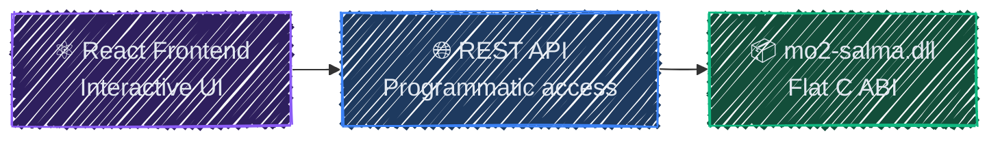
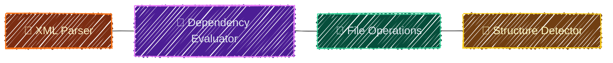
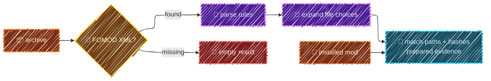
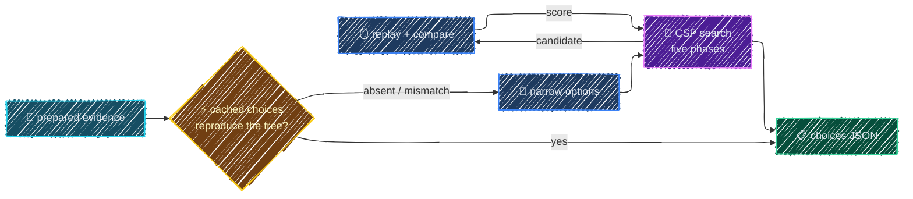
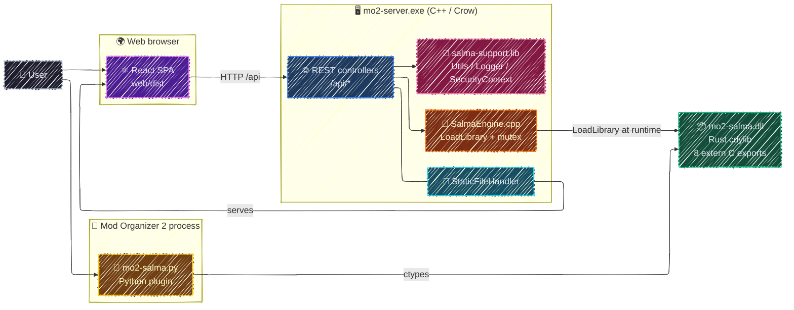
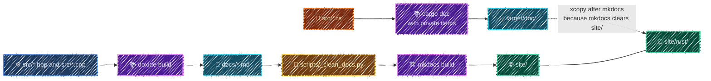

<div align="center">

# salma
**Wizardless FOMOD installer, processor, and selection inference engine**

🎀 [Features](#features) | 💃 [Quick Start](#quick-start) | 📘 [Documentation](#documentation) | 🤝 [Contributing](./CONTRIBUTING.md)

![ReactJS](https://img.shields.io/badge/React-TSX-149ECA.svg?style=flat&logo=)
![Crow](https://img.shields.io/badge/Crow-HTTP-D97706.svg?style=flat&logo=)
![Mo2](https://img.shields.io/badge/%20-MO2_Plugin-64748B.svg?style=flat&logo=)
![Tailwind](https://img.shields.io/badge/Tailwind-CSS-2DD4BF.svg?style=flat&logo=)


![License](https://img.shields.io/badge/License-GPL-475569.svg?logo=)
<br/>
[](https://sonarcloud.io/summary/new_code?id=lextpf_salma)
[](https://sonarcloud.io/summary/new_code?id=lextpf_salma)
[](https://sonarcloud.io/summary/new_code?id=lextpf_salma)
[](https://app.codacy.com/gh/lextpf/salma/dashboard?utm_source=gh&utm_medium=referral&utm_content=&utm_campaign=Badge_grade)
<br/>
[](https://github.com/lextpf/salma/actions/workflows/build.yml)
[](https://github.com/lextpf/salma/actions/workflows/test.yml)
[](https://github.com/lextpf/salma/actions/workflows/eslint.yaml)
<br/>
![Sponsor](https://img.shields.io/static/v1?label=sponsor&message=%E2%9D%A4&color=ff69b4&logo=)
</div>

**salma** installs **FOMOD mods without the wizard**. Point it at an archive and an already-installed copy of that mod, and it recovers which options were originally selected, then replays that install anywhere else. The engine is a **Rust cdylib**. It does archive reading, FOMOD XML processing, install replay and selection inference, and exposes all of it through one **flat C ABI**. Two hosts drive that ABI: a **Python plugin inside Mod Organizer 2**, and a **Crow HTTP server in C++23** that serves a **React dashboard**.

<div align="center">
<br>


</div>
<br>

> [!IMPORTANT]
> **Early release** - salma is under active development and has been tested against:
> - **Nolvus Ascension 6.0.20** with **350 FOMODs**.
> - Other mods should work without issues - if you run into a problem, please report it.

```
/* ============================================================================================== *
 *
 *       ::::::::      :::     :::        ::::    ::::      :::         ⢠⣤⣤⣀ ⠀⠀⠀⠀⠀⠀ ⣀⣤⣤⡄
 *      :+:    :+:   :+: :+:   :+:        +:+:+: :+:+:+   :+: :+:      ⢸⣿⣿⣿⣿⣦⣄⣀⣠⣴⣿⣿⣿⣿⡇⠀⊹
 *      +:+         +:+   +:+  +:+        +:+ +:+:+ +:+  +:+   +:+     ⣸⣿⣿⣿⣿⣿⡽⣿⣯⣿⣿⣿⣿⣿⣇
 *      +#++:++#++ +#++:++#++: +#+        +#+  +:+  +#+ +#++:++#++:    ⢻⣿⣿⣿⠿⣻⣵⡟⣮⣟⠿⣿⣿⣿⡟
 *             +#+ +#+     +#+ +#+        +#+       +#+ +#+     +#+    ⠀⠀⠀⠀⣼⣿⡿ ⠀⢿⣿⣷⡀
 *      #+#    #+# #+#     #+# #+#        #+#       #+# #+#     #+#    ⊹⠀⣠⣾⣿⣿⠃ ⠀⠈⢿⣿⣿⣦⡀
 *       ########  ###     ### ########## ###       ### ###     ###    ⠀⠈⠉⠹⡿⠁⠀⠀⠀⠀⠈⢻⡇⠉⠉
 *
 *                              << F O M O D   E N G I N E >>
 *
 * ============================================================================================== */
```

```
salma/
|-- .github/                              # GitHub config
|   |-- workflows/                        # build.yml, test.yml, sonar.yml, eslint.yaml
|   +-- ISSUE_TEMPLATE/                   # Bug / feature / task issue forms
|-- src/                                  # Both languages, side by side (see the note below)
|   |                                     # -- Rust engine: snake_case *.rs, crate mo2_salma_rs --
|   |-- lib.rs                            # Crate root; declares every engine module
|   |-- capi.rs                           # The eight extern "C" exports; the only ABI boundary
|   |-- types.rs                          # Shared engine types
|   |-- utils.rs                          # Strings, paths, FNV-1a, path-safety guards
|   |-- logger.rs                         # Rotating logs/salma.log + host callback
|   |-- json.rs                           # Owned JSON value model, schema-v2 output
|   |-- archive_service.rs                # Archive listing/extraction (zip, sevenz_rust2, unrar)
|   |-- archive_resolver.rs               # installationFile -> archive fallback chain
|   |-- file_operations.rs                # Queued, priority-sorted file operations
|   |-- mod_structure_detector.rs         # Non-FOMOD content-root detection
|   |-- installation_service.rs           # Top-level install orchestrator
|   |-- fomod_service.rs                  # FOMOD install replay
|   |-- fomod_dependency_evaluator.rs     # FomodCondition tree evaluation
|   |-- fomod_ir.rs                       # FOMOD IR types (Installer/Step/Group/Plugin)
|   |-- fomod_ir_parser.rs                # ModuleConfig.xml -> IR (roxmltree)
|   |-- fomod_atom.rs                     # Atom, AtomIndex, TargetTree types
|   |-- fomod_inference_atoms.rs          # Atom expansion and schema-v2 assembly
|   |-- fomod_propagator.rs               # Deterministic constraint propagation
|   |-- fomod_csp_solver.rs               # Five-phase CSP solve
|   |-- fomod_csp_types.rs                # Solver datatypes
|   |-- fomod_csp_precompute.rs           # Read-only solver precomputation
|   |-- fomod_csp_options.rs              # Per-group option enumeration, SelectAny caps
|   |-- fomod_forward_simulator.rs        # In-memory install replay used as scoring oracle
|   |-- fomod_inference_service.rs        # Inference entry point: infer_selections()
|   |-- inference_diagnostics.rs          # Per-decision reason codes and confidence
|   |                                     # -- C++ server: PascalCase *.hpp / *.cpp --
|   |-- main.cpp                          # Crow HTTP server entry point
|   |-- SalmaEngine.hpp/cpp               # LoadLibrary bridge to mo2-salma.dll
|   |-- Export.hpp                        # MO2_API export macro
|   |-- Types.hpp                         # Shared server type definitions
|   |-- Utils.hpp/cpp                     # String/path helpers the server still needs
|   |-- BackgroundJob.hpp                 # Async job runner (header-only)
|   |-- Logger.hpp/cpp                    # Thread-safe logging
|   |-- InstallationController.hpp/cpp    # REST endpoint handlers
|   |-- Mo2Controller.hpp/cpp             # MO2 dashboard controller (shared state)
|   |-- Mo2...Controller.cpp              # Per-subsystem endpoints (config/fomod/log/plugin/test)
|   |-- Mo2Helpers.hpp/cpp                # Shared helpers for MO2 controllers
|   |-- ConfigService.hpp/cpp             # Configuration management
|   |-- MultipartHandler.hpp/cpp          # Form data parsing
|   |-- StaticFileHandler.hpp/cpp         # SPA serving
|   |-- SecurityContext.hpp/cpp           # CSRF token + Origin allowlist
|   +-- SecurityMiddleware.hpp/cpp        # Crow Origin/CSRF enforcement
|-- web/                                  # React frontend (Vite + TypeScript)
|   |-- src/                              # TSX pages, hooks, and comps/ components
|   |-- dist/                             # Built SPA (served by Crow)
|   |-- index.html                        # Vite entry HTML
|   |-- package.json                      # Dependencies and scripts
|   |-- tsconfig.json                     # TypeScript config
|   |-- eslint.config.js                  # ESLint config (max-warnings 0)
|   +-- vite.config.ts                    # Dev proxy to :5000
|-- tests/                                # Both languages: cargo picks up *.rs, CMake *.cpp
|   |-- inference_diagnostics_test.rs     # Rust integration test: diagnostics reason codes
|   |-- salma_engine_test.cpp             # GoogleTest: the SalmaEngine DLL bridge
|   |-- security_context_test.cpp         # GoogleTest: CSRF / Origin allowlist
|   +-- utils_test.cpp                    # GoogleTest: shared utilities
|-- scripts/                              # MO2 plugin, packaging & utilities
|   |-- mo2-salma.py                      # MO2 Python plugin
|   |-- common.py                         # Shared utilities
|   |-- install.py                        # Installation helper
|   |-- compare.py                        # Round-trip diff utility
|   |-- scan.py                           # Mod scanning utility
|   |-- package.py                        # Stage the deployable mo2-salma.dll
|   |-- smoke_ctypes.py                   # Raw C ABI smoke test
|   |-- smoke_plugin.py                   # MO2 plugin-loader smoke test
|   |-- run_harness.py                    # Round-trip harness against a live MO2
|   |-- _clean_docs.py                    # Doc post-processing
|   +-- _promote_subgroups.py             # Orphaned doc-layout tool; no pipeline runs it
|-- cmake/                                # vcpkg overlay triplet
|   +-- x64-windows-static-md.cmake       # Static-md triplet definition
|-- docs/                                 # Generated API docs (only main.html is checked in)
|   +-- main.html                         # MkDocs theme override
|-- .clang-format                         # clang-format rules (Google-based)
|-- .clang-tidy                           # clang-tidy rules (run by hand)
|-- .clangd                               # clangd language-server config
|-- .gitattributes                        # Git attributes
|-- .gitignore                            # Git ignore rules
|-- Cargo.toml                            # Rust crate manifest (cdylib + rlib)
|-- Cargo.lock                            # Pinned Rust dependency graph
|-- build.rs                              # Cargo build script
|-- CMakeLists.txt                        # C++ build (salma-support, mo2-server, salma_tests)
|-- CMakePresets.json                     # Build presets (vcpkg)
|-- vcpkg.json                            # C++ dependency manifest (Crow, nlohmann-json, gtest)
|-- sonar-project.properties              # SonarCloud configuration
|-- doxide.yml                            # C++ API doc config
|-- mkdocs.yml                            # Documentation site config
|-- setup.bat                             # Persist SALMA_* env vars (one-time setup)
|-- build.bat                             # Build pipeline (engine + server + web + docs)
|-- run.bat                               # Run the dashboard (server :5000 + Vite :3000)
|-- deploy.bat                            # Deploy to MO2
|-- purge.bat                             # Remove plugin & clean output
|-- test.bat                              # Rust suite + the two ABI smoke tests
|-- test_all.py                           # Round-trip test runner (Python)
|-- test_one.py                           # Round-trip test for a single mod
|-- AGENTS.md                             # Agent/contributor working notes
|-- CLAUDE.md                             # Claude Code project instructions
|-- CONTRIBUTING.md                       # Contributor guide
|-- PARITY-NOTES.md                       # Why the engine's odd-looking behaviors are deliberate
|-- CUTOVER.md                            # Deploying the engine DLL, and rolling back
|-- LICENSE.md                            # License
|-- README.md                             # This file
+-- PREVIEW.png                           # README banner image
```

> [!NOTE]
> `src/` and `tests/` hold both languages on purpose. In `src/`, snake_case `.rs`
> files are the engine and PascalCase `.hpp`/`.cpp` pairs are the server. In
> `tests/`, cargo picks up `*.rs` and CMake picks up `*.cpp`; neither build sees
> the other's files.

## Features

### Interface

Three layers, each sitting on the one below it: the engine DLL behind a flat C ABI for direct integration, a REST API for programmatic access, and a React web UI for interactive FOMOD processing and install replay.


```mermaid
---
config:
  look: handDrawn
  theme: mc
  themeVariables:
    fontSize: 18px
  layout: elk
---
graph LR
    classDef dll fill:#134e3a,stroke:#10b981,color:#e2e8f0
    classDef api fill:#1e3a5f,stroke:#3b82f6,color:#e2e8f0
    classDef web fill:#2e1f5e,stroke:#8b5cf6,color:#e2e8f0

    Web["⚛️ React Frontend<br/>Interactive UI"]:::web
    API["🌐 REST API<br/>Programmatic access"]:::api
    DLL["📦 mo2-salma.dll<br/>Flat C ABI"]:::dll

    Web --> API --> DLL
```

### FOMOD Processing


```mermaid
---
config:
  look: handDrawn
  theme: mc
  themeVariables:
    fontSize: 18px
  layout: elk
---
graph LR
    classDef parse fill:#7c2d12,stroke:#f97316,color:#fef3c7
    classDef eval fill:#4c1d95,stroke:#e879f9,color:#e2e8f0
    classDef ops fill:#064e3b,stroke:#34d399,color:#e2e8f0
    classDef detect fill:#713f12,stroke:#facc15,color:#fef9c3

    P["📄 XML Parser"]:::parse
    D["🧩 Dependency Evaluator"]:::eval
    F["📂 File Operations"]:::ops
    S["🔎 Structure Detector"]:::detect

    P --- D --- F --- S
```

- 📄 **XML Parser** - Parses `fomod/ModuleConfig.xml` for installation steps and options
- 🧩 **Dependency Evaluator** - Resolves flag-based and file-based FOMOD dependencies
- 📂 **File Operations** - Priority-sorted file copy, folder creation, and patching
- 🔎 **Structure Detector** - Identifies candidate content roots inside archives (meshes/, textures/, SKSE/, etc.)

### Inference Engine

Inference compares an archive's FOMOD options against an already-installed mod and recovers which selections were originally chosen. Walking every permutation of steps, groups and flags is intractable on large installers, so the pipeline is a layered solver instead.

**1. Prepare the evidence**


```mermaid
---
config:
  look: handDrawn
  theme: mc
  themeVariables:
    fontSize: 16px
  layout: elk
---
flowchart LR
    classDef input fill:#7c2d12,stroke:#f97316,color:#fef3c7
    classDef decision fill:#713f12,stroke:#facc15,color:#fef9c3
    classDef process fill:#4c1d95,stroke:#e879f9,color:#e2e8f0
    classDef evidence fill:#164e63,stroke:#22d3ee,color:#e2e8f0
    classDef failure fill:#7f1d1d,stroke:#f87171,color:#fee2e2

    Archive["📦 archive"]:::input --> XML{"🔎 FOMOD XML?"}:::decision
    XML -- found --> Parse["📄 parse rules"]:::process
    XML -- missing --> Stop["🚫 empty result"]:::failure
    Parse --> Atoms["🧩 expand file choices"]:::process
    Atoms --> Evidence["🔬 match paths + hashes<br/>prepared evidence"]:::evidence
    Installed["📂 installed mod"]:::input --> Evidence
```

**2. Recover the choices**


```mermaid
---
config:
  look: handDrawn
  theme: mc
  themeVariables:
    fontSize: 16px
  layout: elk
---
flowchart LR
    classDef evidence fill:#164e63,stroke:#22d3ee,color:#e2e8f0
    classDef decision fill:#713f12,stroke:#facc15,color:#fef9c3
    classDef process fill:#1e3a5f,stroke:#3b82f6,color:#e2e8f0
    classDef solver fill:#4c1d95,stroke:#e879f9,color:#e2e8f0
    classDef result fill:#064e3b,stroke:#34d399,color:#e2e8f0

    Evidence["🔬 prepared evidence"]:::evidence
    Evidence --> Cache{"⚡ cached choices<br/>reproduce the tree?"}:::decision
    Cache -- yes --> JSON["📋 choices JSON"]:::result
    Cache -- "absent / mismatch" --> Narrow["🧮 narrow options"]:::process
    Narrow --> Solve["🧠 CSP search<br/>five phases"]:::solver
    Solve -- candidate --> Replay["🪞 replay + compare"]:::process
    Replay -- score --> Solve
    Solve --> JSON
```

- ⚡ **Tier-1 candidate** - Reuses cached choices only after they reproduce the installed file tree.
- 🧮 **Constraint propagator** - Narrows valid options using plugin rules and file evidence.
- 🧠 **5-phase CSP solver** - Combines local repair, component search, and wider backtracking.
- 🪞 **Forward simulator** - Replays candidates in memory and compares them with installed files.
- 📋 Produces JSON choices for install replay and round-trip testing.

### MO2 Integration

- 🐍 **Python Plugin** - `mo2-salma.py` loads the DLL via ctypes and exposes tools inside MO2
- 🔬 **Scan FOMOD Choices** - Batch-scans all installed mods for FOMOD selections
- 📁 **Centralized Output** - Saves one JSON record per mod in the "Salma FOMODs Output" folder.
- ⚡ **Deploy & Purge** - `deploy.bat` and `purge.bat` scripts for plugin lifecycle management

### Archive Support

Archive backends are selected by file extension:

|      Extension | Backend crate                                                       |
|----------------|---------------------------------------------------------------------|
|  `.7z`, `.001` | `sevenz_rust2`                                                      |
|         `.rar` | `unrar` (links the proprietary unRAR C sources)                     |
|  anything else | `zip` (this is the fallback, so `.zip` and unknown names land here) |

> [!WARNING]
> There is no TAR backend. `.tar`, `.tar.gz`, `.tar.bz2`, `.tar.xz` and `.tar.zst`
> fall through to the `zip` backend, which cannot read them. The listing and read
> paths report failure as an empty result rather than an error, so such an archive
> looks like an archive with no entries.

### Additional Capabilities

- 🌐 **REST API** - Full programmatic access for custom FOMOD tooling and automation
- 🎨 **Web UI** - React SPA with dark/light theme, served directly by the Crow backend
- 📝 **Logging** - Unified thread-safe logger with subsystem tags; 10 MiB rotation, up to 3 archived files
- 🧪 **Round-Trip Testing** - Infer selections, replay a FOMOD install, and diff against the original mod

### Scope

salma infers and replays FOMOD choices. Recognized non-FOMOD content roots receive a plain copy;
other installer formats remain MO2's responsibility.

### Limits

- 📦 **256 MiB per-archive-entry cap** - Bounds decompressed entry data buffered in memory.
- 📤 **8 GiB upload cap** - Returns HTTP 413 before writing oversized uploads to disk.
- 🛡️ **Path-traversal rejection** - Skips entries that resolve outside the extraction root.
- 🚫 **Shell-metachar sanitization** - Rejects shell metacharacters in deploy and mods paths.
- ✅ **Whitelist regex on `run_tests` args** - Allows letters, digits, spaces, `_`, `-`, and `.`;
  rejects `..`.

## Technology Stack

| Component       | Technology                                                 |
|-----------------|------------------------------------------------------------|
| Engine language | Rust, edition 2024, toolchain 1.85+ (crate `mo2_salma_rs`) |
| Server language | C++23                                                      |
| HTTP Framework  | Crow (behind a custom Origin/CSRF middleware)              |
| Frontend        | React 18 + TypeScript + Vite                               |
| Styling         | Tailwind CSS 4                                             |
| XML Parsing     | roxmltree (engine)                                         |
| JSON            | serde_json (engine) + nlohmann-json (server)               |
| Archive         | zip + sevenz_rust2 + unrar (engine)                        |
| Formatting      | cargo fmt (Rust), clang-format (C++, Google-based)         |
| Build System    | Cargo (engine) + CMake 3.20+ (server)                      |
| Package Manager | cargo (engine) + vcpkg (server)                            |
| Documentation   | rustdoc (engine) + Doxide/MkDocs (C++)                     |
| Plugin          | Python 3 (MO2 ctypes bridge)                               |
| CI/CD           | GitHub Actions                                             |
| Platform        | Windows 10/11 (64-bit)                                     |

## Quick Start

### Prerequisites

Required for any build:

- **Windows 10/11** (64-bit)
- **Rust 1.85+** via [rustup](https://rustup.rs)
- **Visual Studio 2022** (MSVC v143, C++23) - supplies the linker and C compiler.

Required only for the C++ server half:

- **CMake 3.20+**
- **vcpkg** - set `VCPKG_ROOT`; without it, `build.bat` skips the server.

Required only for the dashboard and the tooling:

- **Node.js** - builds the React dashboard.
- **Python 3** - MO2 plugin, DLL packaging, smoke tests, and documentation tools.
- **clang-format** (optional, for manual C++ formatting)
- **doxide** + **mkdocs** (optional, for C++ API docs; Rust docs use rustdoc)

### Building

```powershell
# 1. Clone the repository
git clone https://github.com/lextpf/salma.git
cd salma

# 2. Build (format + configure + compile + docs)
.\build.bat

# 3. Run the server
.\build\bin\Release\mo2-server.exe
```

Output:

- Engine: `target/package/mo2-salma.dll`, staged from `target/release/mo2_salma_rs.dll`
- Server: `build/bin/Release/mo2-server.exe`
- Engine copy beside the server: `build/bin/Release/mo2-salma.dll`
- Web UI: `web/dist/`

Build C++ tests separately; see [Testing](#testing).

For a faster iteration loop, build one half at a time:

```powershell
# Engine only
cargo build --release                                      # -> target\release\mo2_salma_rs.dll
python scripts\package.py --no-build                       # stage it as mo2-salma.dll + sha256

# Server only (configure once; the preset reads VCPKG_ROOT)
cmake --preset default
cmake --build build --config Release --target mo2-server   # EXE only
cmake --build build --config Release --target salma_tests  # C++ unit-test binary only
```

`build.bat` runs formatting, Clippy, builds, packaging, and documentation. Optional components
skip when their tools are unavailable; Rust build and lint failures stop the pipeline.

### Frontend development

Use Vite for frontend development, with `/api/*` proxied to the C++ server:

```powershell
cd web
npm install    # one-time
npm run dev    # Vite dev server on :3000, proxies /api -> :5000
npm run build  # outputs to web/dist/, served by Crow at :5000
npm run lint   # eslint, max-warnings=0
```

> [!IMPORTANT]
> Start `mo2-server.exe` on `:5000` **before** `npm run dev`. Vite's proxy assumes the backend is already up; if it isn't, every `/api/*` request the SPA makes will fail with a proxy error and the UI will look broken.

Run `.\build.bat` first, then `.\run.bat` to start both servers and open the dashboard.
`run.bat` does not build.

> [!NOTE]
> The script is `run.bat`, not `start.bat`: `start` is a cmd built-in and a PowerShell alias for `Start-Process`, so typing `start` would never reach it. Typing `run` resolves to `run.bat`, the same way `build` resolves to `build.bat`.

### Deploying to MO2

```powershell
# Copy DLL + Python plugin to your MO2 instance
.\deploy.bat
```

`deploy.bat` **requires** `SALMA_DEPLOY_PATH`; run `.\setup.bat` once to set it.

The two files go to two different places:

| File | Destination |
|------|-------------|
| `mo2-salma.dll` | `%SALMA_DEPLOY_PATH%\salma\mo2-salma.dll` (the `salma\` subdirectory, created if absent) |
| `mo2-salma.py`  | `%SALMA_DEPLOY_PATH%\mo2-salma.py` |

Keep the DLL in the `salma/` subdirectory; the plugin searches there first. `purge.bat`
removes both files. The dashboard can derive a deploy path from the mods directory;
`deploy.bat` requires the explicit environment variable.

## Configuration & Environment

Run `setup.bat` once to set the paths used by the MO2 tools and round-trip tests:

```powershell
.\setup.bat   # sets the three SALMA_* vars via setx (persists across shells)
```

| Variable               | Folder            |
|------------------------|-------------------|
| `SALMA_MODS_PATH`      | MO2 mods          |
| `SALMA_DEPLOY_PATH`    | MO2 plugins       |
| `SALMA_DOWNLOADS_PATH` | Download archives |

The dashboard stores its mods path in `salma.json` beside the server.

## Testing

Rust, C++, and live MO2 round trips have separate test commands.

### 🦀 Rust suite + ABI smoke tests

```powershell
.\test.bat
```

`test.bat` runs Rust release tests, ctypes ABI checks, and plugin-loader smoke tests.
Build the DLL first with `build.bat` or `cargo build --release`. Python checks skip when
Python is unavailable; C++ tests run separately.

To run part of the Rust suite directly:

```powershell
cargo test --release -- utils::                          # one module's unit tests
cargo test --release --test inference_diagnostics_test   # the only Rust integration test file
```

### ⚙️ C++ unit tests (GoogleTest)

Build and run the separate `salma_tests` target:

```powershell
cmake --build build --config Release --target salma_tests
.\build\bin\Release\salma_tests.exe --gtest_filter=SalmaEngine.*
ctest --preset ci                                        # what test.yml runs
```

Register new C++ test files in the root `CMakeLists.txt` source list.

### 🔁 Round-trip integration tests (Python)

```powershell
python scripts\run_harness.py        # test_all.py with the stale-DLL trap handled
python test_all.py                   # walks every mod under SALMA_MODS_PATH
python test_one.py <archive> <mod>   # single-mod variant for debugging
```

The harness infers choices, reinstalls each mod into a temporary directory, and compares
file trees. Results go to `test.log`; engine logs go to `logs/salma.log` beside the loaded DLL.

> [!IMPORTANT]
> `find_dll` prefers the deployed DLL, so a plain `python test_all.py` can validate a binary you did not just build. `scripts/run_harness.py` closes that hole: it stages the DLL under test, redirects `SALMA_DEPLOY_PATH` for the child process only, and re-hashes the file the harness reports loading.

Set the MO2 paths with `setup.bat`; see [Configuration & Environment](#configuration--environment).

## Architecture

The Rust engine handles parsing, inference, and install replay. The MO2 plugin and C++ server
call its C ABI; the React dashboard talks to the server.


```mermaid
---
config:
  look: handDrawn
  theme: mc
  themeVariables:
    fontSize: 18px
  layout: elk
---
graph LR
    classDef user fill:#1e1e2e,stroke:#94a3b8,color:#e2e8f0
    classDef plugin fill:#713f12,stroke:#facc15,color:#fef9c3
    classDef web fill:#4c1d95,stroke:#e879f9,color:#e2e8f0
    classDef api fill:#1e3a5f,stroke:#3b82f6,color:#e2e8f0
    classDef static fill:#164e63,stroke:#22d3ee,color:#e2e8f0
    classDef bridge fill:#7c2d12,stroke:#f97316,color:#fef3c7
    classDef support fill:#831843,stroke:#f472b6,color:#fce7f3
    classDef core fill:#134e3a,stroke:#10b981,color:#e2e8f0

    User["👤 User"]:::user

    subgraph MO2["🧩 Mod Organizer 2 process"]
        Plugin["🐍 mo2-salma.py<br/>Python plugin"]:::plugin
    end

    subgraph Browser["🌍 Web browser"]
        SPA["⚛️ React SPA<br/>web/dist"]:::web
    end

    subgraph SrvHost["🖥️ mo2-server.exe (C++ / Crow)"]
        Server["🌐 REST controllers<br/>/api/*"]:::api
        Static["📄 StaticFileHandler"]:::static
        Bridge["🔌 SalmaEngine.cpp<br/>LoadLibrary + mutex"]:::bridge
        Support["🧰 salma-support.lib<br/>Utils / Logger / SecurityContext"]:::support
    end

    Engine["📦 mo2-salma.dll<br/>Rust cdylib<br/>8 extern C exports"]:::core

    User --> Plugin
    User --> SPA
    Plugin -- "ctypes" --> Engine
    SPA -- "HTTP /api" --> Server
    Static -- "serves" --> SPA
    Server --- Static
    Server --> Bridge
    Server --> Support
    Bridge -- "LoadLibrary at runtime" --> Engine
```

### The artifacts

- **📦 `mo2-salma.dll` - the engine.** Rust library shared by both hosts.
- **🌐 `mo2-server.exe` - the HTTP host.** Loads the engine and serves `/api/*` and the dashboard
  on port 5000.
- **⚛️ `web/dist/` - the browser front-end.** Vite-built UI for installs, choices, progress, and logs.

> [!IMPORTANT]
> The server loads the engine instead of linking it, so `mo2-server.exe` and `mo2-salma.dll` are separate files that can drift to different versions. CMake refreshes the copy beside the exe only when the C++ is rebuilt, so a plain `build.bat` can leave the dashboard on an old engine. `run.bat` byte-compares `build\bin\Release\mo2-salma.dll` against `target\package\mo2-salma.dll` and warns on a mismatch.

### The C ABI is the only boundary

Both hosts use the same engine through a flat C ABI. See the [API documentation](#documentation)
for integration and ownership details.

### Two ways salma is used

**Path A - inside Mod Organizer 2 (no server, no browser).** Deploy the DLL and Python plugin,
then use MO2's tools to install archives or scan existing mods for choices.

**Path B - the standalone server with the web UI.** Run `mo2-server.exe` and open
`http://localhost:5000` to upload archives, inspect choices, and follow progress.

## Documentation

`build.bat` generates both API references:

| Half | Generator | Output |
| --- | --- | --- |
| Rust engine (`src/*.rs`, ~29k LOC) | `rustdoc` | `site/rust/mo2_salma_rs/` |
| C++ server (`src/*.{hpp,cpp}`, ~7k LOC) | doxide -> `_clean_docs.py` -> mkdocs | `site/` |

Open `site/index.html` for the combined documentation.


```mermaid
---
config:
  look: handDrawn
  theme: mc
  themeVariables:
    fontSize: 16px
---
flowchart LR
    classDef rust fill:#7c2d12,stroke:#f97316,color:#fef3c7
    classDef cpp fill:#1e3a5f,stroke:#3b82f6,color:#e2e8f0
    classDef generator fill:#4c1d95,stroke:#e879f9,color:#e2e8f0
    classDef intermediate fill:#164e63,stroke:#22d3ee,color:#e2e8f0
    classDef cleanup fill:#713f12,stroke:#facc15,color:#fef9c3
    classDef output fill:#064e3b,stroke:#34d399,color:#e2e8f0

    RS["🦀 src/*.rs"]:::rust --> RD["📚 cargo doc<br/>with private items"]:::generator
    RD --> TD["📂 target/doc/"]:::intermediate
    CPP["⚙️ src/*.hpp and src/*.cpp"]:::cpp --> DX["📚 doxide build"]:::generator
    DX --> MD["📄 docs/*.md"]:::intermediate
    MD --> CL["🧹 scripts/_clean_docs.py"]:::cleanup --> MK["🏗️ mkdocs build"]:::generator
    MK --> SITE["🌐 site/"]:::output
    TD -. "xcopy after mkdocs<br/>because mkdocs clears site/" .-> RUST["🦀 site/rust/"]:::output
    SITE --- RUST
```

To build manually, keep this order: MkDocs clears `site/`, so copy Rustdoc last.

```powershell
# 1. Rust engine API. --document-private-items is required: this crate's module
#    docs explain internals and link to private helpers.
cargo doc --no-deps --release --document-private-items

# 2. Generate markdown from C++ headers
doxide build

# 3. Post-process (strip noise, fix formatting, inject the Rust cross-link)
python scripts/_clean_docs.py

# 4. Build the documentation site. This clears site/ first, so it must run
#    before the copy below, not after.
mkdocs build

# 5. Stage the rustdoc output inside the site
xcopy /e /i /q /y target\doc site\rust
```

Use `mkdocs serve` for C++ docs or open `site/rust/mo2_salma_rs/index.html` for Rust.
Edit source comments, not generated pages; stale `docs/` pages need removal after navigation
changes, preserving `docs/main.html`.

## Contributing

Contributions are welcome! Please read the [Contributing Guidelines](CONTRIBUTING.md) before submitting pull requests.

### Development Workflow

1. Fork the repository
2. Create a feature branch (`git checkout -b feature/amazing-feature`)
3. Make your changes
4. Run `.\test.bat` and make sure `.\build.bat` passes
5. Commit with descriptive messages
6. Push to your fork and open a Pull Request

## License

This project is licensed under the GPL License - see the [LICENSE](LICENSE.md) file for details.

## Acknowledgments

- [MO](https://github.com/ModOrganizer2/modorganizer) - Mod Organizer for managing mod collections
- [Crow](https://crowcpp.org/) - C++ HTTP framework
- [React](https://react.dev/) - Frontend UI library
- [zip](https://github.com/zip-rs/zip2) - ZIP reading and writing in Rust
- [sevenz-rust2](https://github.com/hasenbanck/sevenz-rust2) - 7z reading in Rust
- [unrar](https://github.com/muja/unrar.rs) - RAR reading, wrapping the unRAR C sources
- [roxmltree](https://github.com/RazrFalcon/roxmltree) - XML parsing in Rust
- [serde_json](https://github.com/serde-rs/json) - JSON for Rust
- [nlohmann-json](https://github.com/nlohmann/json) - JSON for Modern C++
- [vcpkg](https://github.com/microsoft/vcpkg) - C++ package manager
- [Doxide](https://github.com/lawmurray/doxide) - API documentation generator
- [MkDocs Material](https://squidfunk.github.io/mkdocs-material/) - Documentation theme
- [Tailwind CSS](https://tailwindcss.com/) - Utility-first CSS framework
- [Claude](https://claude.ai/) - AI coding assistant by Anthropic
- [Codex](https://openai.com/index/openai-codex/) - AI coding assistant by OpenAI
